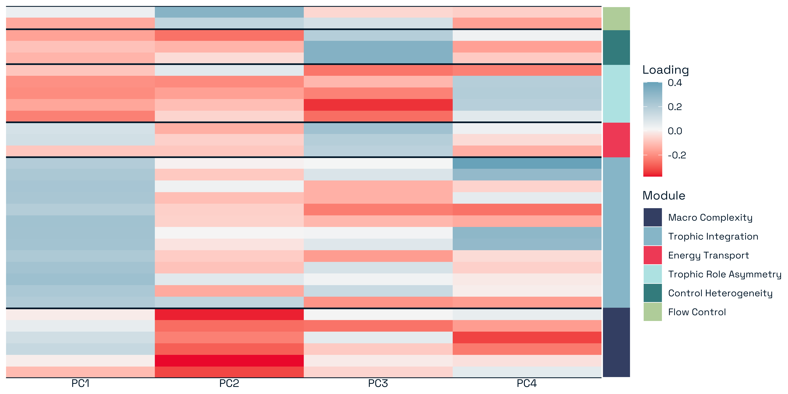
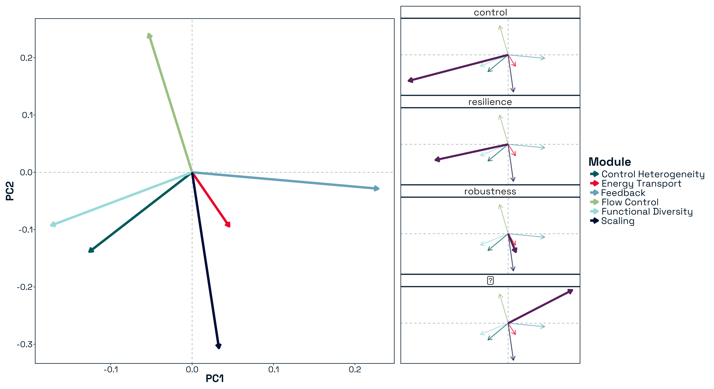

# Introduction

> Which metrics best represent the distinct stages of the energy-flow hierarchy, and do they capture different components of stability?

> Food web structure self-organises into process-level modules, and those modules govern different components of stability.

> Food web architecture is organised into emergent structural process modules, and different modules regulate different components of ecological stability.

> Food web metrics self-organise into structural process modules, these modules define network space, and different modules regulate different stability components.

> Should we be looking at if different metrics scale predictably with each other?

> Emergent property (thinking like the cool tensor work/dynamic models) vs static metrics (using one measure of structure)

Ecological networks are commonly characterised using a large and diverse set of structural metrics, yet there remains little consensus on how these metrics should be interpreted or compared across studies [@vermaatMajorDimensionsFoodweb2009; @lauEcologicalNetworkMetrics2017]. Measures of connectance, trophic level, modularity, omnivory, motif structure, and many others are routinely invoked as indicators of ecosystem organisation or stability. However, these descriptors often covary strongly, capture overlapping information, or reflect different scales of network organisation. As a result, studies using different subsets of metrics frequently arrive at conflicting conclusions about the relationship between network structure and ecological stability.

Ecological theory has long sought general principles linking the architecture of interaction networks to ecosystem stability. Early theoretical work framed this relationship in terms of system complexity, most famously through the analysis of random community matrices by Robert May, who showed that increasing species richness, interaction density, and interaction strength variance should reduce local dynamical stability in large ecological systems [@mayWillLargeComplex1972; @mayStabilityComplexityModel1974]. Subsequent work refined this prediction by demonstrating that specific forms of network organisation such as interaction structure, trophic hierarchy, and compartmentalisation can substantially alter stability outcomes [@mccannDiversityStabilityDebate2000; @allesinaStabilityCriteriaComplex2012; @stoufferUnderstandingFoodwebPersistence2010]. More recently, structural theories such as trophic coherence have proposed that food webs occupy constrained regions of structural space in which particular architectural features strongly influence system stability [@johnsonTrophicCoherenceDetermines2014]. At the same time, ecological stability itself is now widely recognised as a multidimensional concept encompassing distinct dynamical properties such as persistence, resistance to disturbance, and recovery dynamics [@dominguez-garciaUnveilingDimensionsStability2019; @ivesStabilityDiversityEcosystems2007; @loreauBiodiversityEcosystemStability2013; @donohueNavigatingComplexityEcological2016]. Together these developments suggest that the relationship between network structure and ecological stability may be more complex than originally assumed, specifically that both structure and stability are multidimensional properties of ecological systems. If so, apparent inconsistencies in the structure–stability literature may arise not because theoretical predictions are incorrect, but because different studies measure different aspects of network architecture and different components of ecological stability.

One explanation for this inconsistency is that network structure is fundamentally multidimensional. Rather than representing a single property of ecosystems, structural metrics may capture different aspects of how interactions are organised and how energy moves through ecological systems. If this is the case, then individual metrics should not be expected to provide a universal predictor of stability. Instead, they may represent distinct dimensions of structural organisation that relate to different ecological mechanisms. Despite this possibility, most studies treat structural descriptors independently or select a small subset based on convention or data availability. Relatively few attempts have been made to examine whether commonly used network metrics organise into a smaller set of coherent structural dimensions that define the underlying space of ecological network architecture.

Ecological stability is likewise not a single property but a collection of related dynamical behaviours [@pimmComplexityStabilityEcosystems1984; @ivesStabilityDiversityEcosystems2007]. Different studies have emphasised different stability components, including the persistence of species [REF], the resistance of communities to disturbance [REF], and the speed with which systems recover following perturbation [REF]. These processes reflect distinct aspects of ecosystem dynamics and may depend on different features of network structure. From an energy-flow perspective, three stability mechanisms are particularly relevant: persistence, resistance, and return. Persistence refers to the continued maintenance of energy flow and species presence following species loss or environmental change. Resistance describes the degree to which disturbances propagate through ecological interactions, potentially amplifying or dampening perturbations. Return captures the capacity of a system to reorganise and re-establish stable interaction patterns following disturbance. Because these mechanisms operate through different ecological processes, they may be expected to depend on different aspects of network architecture. Structural features related to species roles and redundancy may influence persistence, whereas properties governing interaction pathways and network organisation may affect disturbance propagation or recovery dynamics.

Within this framework, metrics that are often treated as competing predictors of 'stability' instead emerge as complementary descriptors of different stability mechanisms [@thompsonFoodWebsReconciling2012]. Node-level metrics primarily relate to persistence, path-level metrics to resistance, and global organisational metrics to return dynamics. Some descriptors span multiple scales, reflecting the coupling between structural organisation and emergent behaviour [@allesinaStabilityCriteriaComplex2012]. This perspective provides a mechanistic explanation for why studies using different network metrics frequently report contrasting structure–stability relationships. Rather than reflecting inconsistency or redundancy, these differences arise because different metrics implicitly target different components of stability [@lauEcologicalNetworkMetrics2017]. By explicitly linking structural scale, energy flow, and stability mechanism, this framework provides a principled basis for interpreting network metrics and for selecting descriptors that align with specific ecological questions.

Here we investigate whether the large number of structural metrics used to characterise food webs can be reduced to a smaller set of coherent structural dimensions, and whether these dimensions relate to different components of ecological stability. Using a compilation of empirical food webs, we quantified a broad suite of commonly used network descriptors spanning species roles, interaction pathways, and global network organisation. We first examined whether these metrics self-organise into statistically robust modules based on their covariation across ecosystems. We then evaluated how these modules align with dominant multivariate axes of structural variation. Finally, we compared alternative representations of network structure to assess how different structural dimensions relate to three stability properties: robustness to species loss, spectral radius, and structural complexity. By explicitly mapping the multivariate structure of network architecture to stability outcomes, this analysis provides a principled framework for interpreting network metrics and for selecting structural descriptors that match specific ecological questions.

# Materials & Methods

## Data Compilation

We compiled food web data from Mangal [@poisotMangalMakingEcological2016], Web of Life [@fortunaWebLife2014], and the canonical networks used by @vermaatMajorDimensionsFoodweb2009, resulting in a total of XX networks. All networks were treated as binary and characterised using a suite of XX structural metrics (see @tbl-properties).

| Label | Definition | Structural interpretation | Reference |
|------------------|------------------|--------------------|------------------|
| Basal | Proportion of taxa with zero vulnerability (no consumers). | Quantifies the proportion of species representing basal energy inputs to the network. |  |
| Top | Proportion of taxa with zero generality (no resources). | Describes the relative prevalence of terminal consumers in the network. |  |
| Intermediate | Proportion of taxa with both consumers and resources. | Captures the proportion of species participating in both upward and downward energy transfer. |  |
| Richness (S) | Number of taxa (nodes) in the network. | Describes network size. |  |
| Links (L) | Total number of trophic interactions (edges). | Describes interaction density independent of network size. |  |
| Connectance | $L/S^2$, where $S$ is the number of species and $L$ the number of links | Measures the proportion of realised interactions relative to all possible interactions. | Dunne et al. 2002 |
| L/S | Mean number of links per species. | Captures average interaction density per taxon. |  |
| Cannibal | Proportion of taxa with self-loops. | Quantifies the prevalence of cannibalistic interactions. |  |
| Herbivore | Proportion of taxa feeding exclusively on basal species. | Describes the representation of primary consumers. |  |
| Intermediate | Percentage of intermediate taxa (with both consumers and resources) |  |  |
| Trophic level (TL) | Prey-weighted trophic level averaged across taxa. | Captures the vertical organisation of energy transfer. | @williamsLimitsTrophicLevels2004 |
| MaxSim | Mean maximum trophic similarity of each taxon to all others. | Quantifies functional similarity based on shared predators and prey. | @yodzisSearchOperationalTrophospecies1999 |
| Centrality | Node centrality averaged across taxa (definition-dependent). | Captures the distribution of influence or connectivity among species. | @estradaUsingNetworkCentrality2008 |
| ChLen | Mean length of all food chains from basal to top taxa. | Describes the average number of steps in energy-transfer pathways. |  |
| ChSD | Standard deviation of food chain length. | Captures variability in pathway lengths. |  |
| ChNum | Log-transformed number of distinct food chains. | Quantifies the multiplicity of alternative energy pathways. |  |
| Path | Mean shortest path length between all species pairs. | Describes the average distance between taxa within the network. |  |
| Diameter | Maximum shortest path length between any two taxa. | Captures the largest network distance between species. |  |
| Omnivory | Proportion of taxa feeding on resources at multiple trophic levels. | Describes vertical coupling of energy channels. | @mccannDiversityStabilityDebate2000 |
| Loop | Proportion of taxa involved in trophic loops. | Quantifies the prevalence of cyclic interaction pathways. |  |
| Prey:Predator | Ratio of prey taxa (basal + intermediate) to predator taxa (intermediate + top). | Describes the overall shape of the trophic structure. |  |
| Diameter | Diameter can also be measured as the average of the distances between each pair of nodes in the network |  |  |
| Clust | Mean clustering coefficient. | Measures the tendency for taxa sharing interaction partners to also interact with each other. | @wattsCollectiveDynamicsSmallworld1998 |
| GenSD | Normalised standard deviation of generality. | Captures heterogeneity in the number of resources per taxon. | @williamsLimitsTrophicLevels2004 |
| VulSD | Normalised standard deviation of vulnerability. | Captures heterogeneity in the number of consumers per taxon. | @williamsLimitsTrophicLevels2004 |
| LinkSD | Normalised standard deviation of total links per taxon. | Quantifies variation in species connectivity. |  |
| Intervality | Degree to which taxa can be ordered along a single niche dimension. | Measures the extent of niche ordering in trophic interactions. | @stoufferRobustMeasureFood2006 |
| S1 (Linear chain) | Frequency of three-node linear chains (A → B → C) with no additional links. | Captures the prevalence of simple, unbranched energy-transfer pathways. | @stoufferEvidenceExistenceRobust2007 @miloNetworkMotifsSimple2002 |
| S2 (Omnivory) | Frequency of three-node motifs forming a feed-forward loop (A → B → C, A → C). | Describes vertical coupling of trophic levels within small subnetworks. | @stoufferEvidenceExistenceRobust2007 @miloNetworkMotifsSimple2002 |
| S4 (Apparent competition) | Frequency of motifs where one consumer feeds on two resources (A → B ← C). | Captures the prevalence of shared-predator structures among resources. | @stoufferEvidenceExistenceRobust2007 @miloNetworkMotifsSimple2002 |
| S5 (Direct competition) | Frequency of motifs where two consumers share a single resource (A ← B → C). | Describes the occurrence of shared-resource structures among consumers. | @stoufferEvidenceExistenceRobust2007 @miloNetworkMotifsSimple2002 |
| trophicVar | Measure of how much the trophic positions of species deviate from the mean trophic level. | Variance is linked to chain length, with low variance indicating few long chains and high variance indicates long chains and varied interactions | @pimmFoodWebs1982 |
| TrophicCoherence | Measure how well the species in a food web fit into discrete trophic levels. | Highly coherent, neatly layered food webs are more stable to perturbations | @johnsonTrophicCoherenceDetermines2014 |

: An informative caption about the different network properties. We use a combination of metrics from both the original @vermaatMajorDimensionsFoodweb2009 paper as well as including those that have been identified by @thompsonFoodWebsReconciling2012 and have been linked to emerging ecosystem properties such as stability {#tbl-properties}

In addition to network structural descriptors, we quantified multiple complementary measures of ecological stability that reflect different dynamical processes. Specifically, we included (1) Robustness (as area under extinction curve), which measures the proportion of secondary extinctions following sequential species loss and captures tolerance to perturbation [@dunneNetworkStructureBiodiversity2002]; (2) Complexity (SVD), defined as the Shannon entropy of the singular value decomposition of the adjacency matrix, representing heterogeneity in interaction pathways and potential system-level fragility [@strydomSVDEntropyReveals2021]; (3) Spectral Radius ($\rho$), the largest real part of the eigenvalues of the adjacency matrix and can conceptually $\rho$ be thought of as a unipartite equivalent of nestedness [@staniczenkoGhostNestednessEcological2013] making it a proxy for network persistence [@bascompteNestedAssemblyPlantanimal2003]; and (4) Structural Controllability, which evaluates the minimum number of driver species required to control the network’s dynamics and thus captures the capacity for directed reorganisation following perturbation [@liuControllabilityComplexNetworks2011]. Together, these metrics operationalise multiple facets of ecological stability, linking structural organisation to distinct dynamical processes within food webs.

## Identification of Structural Modules

We tested the hypothesis that structural descriptors of food webs are organised into statistically coherent modules reflecting shared ecological function or scaling relationships, rather than forming arbitrary clusters driven by sampling noise. If such modular organisation exists, then metrics within a module should exhibit strong internal correlation relative to metrics assigned to different modules. The resulting clusters should be robust to resampling of the data. The identified modular structure should exceed expectations under null models of random association among metrics.

We quantified pairwise associations among the XX structural metrics using Pearson correlations computed across food webs. Because ecological metrics may covary either positively or negatively depending on scaling relationships, we constructed two alternative distance matrices: $1−r$, which preserves the sign of correlations and distinguishes positive from negative association and $1−∣r∣$, which groups variables based on the magnitude of their association regardless of sign. These two definitions allow us to test whether modular structure depends on directional relationships or simply on the strength of coupling among metrics. Hierarchical clustering was performed using average linkage on each distance matrix to identify candidate structural modules.

The optimal number of clusters was evaluated across a range of partition sizes ($k = 2–10$) using average silhouette width to assess within-cluster cohesion and between-cluster separation. To further evaluate cluster robustness, we implemented bootstrap resampling with 1,000 bootstrap replicates. This procedure estimates approximately unbiased (AU) p-values for each cluster, quantifying the probability that a cluster is supported under repeated resampling of the data. Clusters were considered statistically robust when they exhibited high silhouette support, and approximately unbiased bootstrap support ≥ 0.95. This dual criterion ensures that identified modules are both structurally coherent and stable to sampling variation.

## Multivariate Structure and Module–Axis Alignment

To evaluate whether structural metrics of food webs organise into coherent multivariate modules and whether those modules define principal axes of variation, we conducted a principal component analysis (PCA) followed by a permutation-based test of module–axis alignment. Under this framework, principal components define dominant structural gradients in the metric space, whereas modules represent hypothesised mechanistic groupings of structurally related metrics. Demonstrating alignment between these two representations would suggest that modular decomposition captures fundamental axes of ecological variation.

Skewed count-based metrics (*e.g.,* link counts, interval counts, and related quantities) were log-transformed using $log(x + 1)$ to reduce right skew. All remaining variables were standardised to zero mean and unit variance prior to analysis to ensure that metrics measured on different scales contributed equally to the ordination.

To quantify how structural modules align with principal axes, we decomposed variance in each principal component according to module membership. For each module $m$ and principal component $k$, we computed:

$$ 
A_{mk} = \sum_{i \in m} l^{2}_{ik}
$$

where $l_{ik}$ is the loading of metric $i$ on $PC_k$ and $A_{mk}$ represents the fraction of variance in $PC_k$ attributable to metrics in module $m$. Because squared loadings sum to one within each principal component, this provides a direct partitioning of PC variance across modules. This produces a module × PC matrix describing geometric alignment between modular structure and multivariate axes.

To evaluate whether observed module–PC alignment exceeded expectations under random module structure, we implemented a permutation test. We randomly permuted module labels among metrics 1 000 times while preserving the number and size distribution of modules, and the PCA loadings. For each permutation $r$, we recomputed $A^{(r)}_{mk}$ so as to form a null distribution for each module–PC pair. From this we computed p-values and corresponding z-scores, which was then used to infer significant alignment when $p_{mk} < 0.05 \land |Z_{mk}| > 1.96$

where:

$$ 
p_{mk} = P(A^{(r)}_{mk} > A_{mk})
$$

and:

$$ 
Z_{mk} = \frac{A_{mk} - \mu_{mk}}{\sigma_{mk}}
$$

Additionally we also evaluated if modules collectively aligned with PCA structure beyond random expectation. Overall concentration of variance within module–PC space was calculated as $T = \sum_{m, k} A^{2}_{mk}$ and significance was determined by comparing the observed ($T$) the permutation distribution ($T^{(r)}$). Where $p_{global} = P(T^{(r)} \geq T)$. A significant result indicates that module structure explains multivariate variance better than random groupings.

## Structural Metric Reduction and Representation of Network Space

To evaluate how network structure predicts ecological stability, we first reduced a high-dimensional set of topological metrics into alternative, biologically interpretable predictor sets. Because dimensionality reduction can fundamentally shape inference, we explicitly compared two conceptually distinct representations of network structure: (1) structural domain representatives and (2) latent axes of network variation.

### Identification of Structural Domains

We previously grouped network metrics into clusters based on their pairwise correlations, such that each cluster represented a structurally coherent domain (*e.g.,* trophic composition, centralisation, path structure). Clustering was performed using correlation-based distance, ensuring that metrics grouped together reflected shared structural information rather than raw scale. To construct a reduced predictor set from these domains, we selected a single representative metric per cluster using a medoid approach. Within each cluster, we computed the absolute correlation matrix among member metrics and defined distance as $1−∣r∣$. The medoid was identified as the metric minimising mean pairwise distance to other metrics in the cluster. This approach preserves structural diversity while minimising redundancy and does not rely on principal component loadings, which can bias selection toward dominant variance axes. The resulting 'cluster medoid' set retained one interpretable metric per structural domain. Importantly, this procedure prioritises preservation of structural domains rather than overall variance magnitude, allowing low-variance but potentially mechanistically relevant features of network topology to be retained.

### Extraction of Latent Structural Axes

As a complementary representation of network structure, we performed principal component analysis (PCA) on the scaled full metric matrix. Principal components were retained until cumulative explained variance exceeded 80%, yielding a set of orthogonal axes describing the dominant gradients of variation in network topology. These retained PC scores constitute a low-dimensional latent representation of network space. Unlike cluster medoids, which preserve structural categories, PC scores preserve maximal variance and ensure orthogonality among predictors. We also explored a third reduction approach—selecting the single highest-loading metric per retained PC. However, because principal components are linear combinations of multiple metrics, this PC-dominant metric strategy substantially reduces the variance represented by each axis. Consequently, this approach captures less of the total structural variance.

### Conceptual Contrast Between Representations

The cluster-medoid and PCA-score representations reflect different theoretical assumptions about how structure relates to stability. The cluster-medoid approach assumes that ecological stability responds to discrete structural domains that may vary independently and need not align with the dominant gradients of network variation. In contrast, the PCA-score approach assumes that stability responds primarily to the major axes of variation in network topology, regardless of their interpretability in terms of structural domains. By explicitly comparing predictive performance across these representations, we test whether ecological stability is better explained by domain-specific structural mechanisms or by global geometric gradients of network organisation.

## Structural Control of Stability

To evaluate how hierarchical representations of network structure explain variation in stability, we modelled four complementary stability outcomes: Robustness ($R_{50}$), Complexity (SVD), Spectral Radius (ρ), and Structural Controllability. These measures capture distinct dynamical processes governing ecosystem persistence, resistance, and controllability. Elastic net regression models were fit separately for each stability metric using three structural representations (cluster medoids, PC-dominant metrics, and full PCA scores), allowing us to compare the structural determinants of different stability processes. All predictors and response variables were standardised prior to analysis to allow direct comparison of coefficient magnitudes.

Elastic net regularisation was chosen because it permits inference under correlated predictors by interpolating between ridge (distributed shrinkage) and lasso (sparse selection) penalties. The mixing parameter $\alpha$ (0–1) determines the degree of sparsity, with lower $\alpha$ values indicate distributed influence across many correlated structural descriptors (ridge-like behaviour), whereas higher $\alpha$ values indicate that stability is driven by a smaller subset of structural predictors (lasso-like sparsity)..

### Model Evaluation

Predictive performance was assessed using repeated v-fold cross-validation (5 folds x 10 repeats). Within each training partition, models were fit across a grid of α values (0–1 in increments of 0.25), and the optimal penalty strength (λ) was selected via internal cross-validation within each training partition. Performance was quantified as cross-validated $R^2$ computed on held-out test partitions. After cross-validation, final models were refit to the full dataset using the mean selected $\alpha$, and standardised coefficients were extracted to characterise the direction and magnitude of structural effects. The objective of this analysis was not predictive optimisation, but rather to quantify how structural organisation governs different stability processes. The elastic net mixing parameter α also provides insight into the architecture of structural control. To quantify the relative contribution of different structural modules, standardized regression coefficients from the final models were squared and aggregated within modules. The proportion of explained variance attributable to each module was then scaled by the model's cross-validated $R^2$, providing a measure of the absolute variance in stability explained by each structural component.

# Results

## Structural Metrics Organise into Robust Modules

Hierarchical clustering of structural descriptors revealed clear modular organisation within food-web architecture [@fig-cluster]. Silhouette analysis indicated an optimal partition of the signed correlation matrix at k=7 modules, with a maximum average silhouette width of \[insert value\]. Clustering based on absolute correlations produced a slightly coarser but comparable solution (k=5), demonstrating that the modular structure is robust to the treatment of correlation sign and reflects strong underlying association patterns among metrics.

{#fig-cluster}

Bootstrap resampling further supported the stability of the major clusters. Most principal modules exhibited high approximately unbiased (AU) support values (AU ≥ \[insert value\]), indicating that the identified clusters are not artefacts of sampling variability but represent statistically robust groupings of structural descriptors.

The resulting modular partition identified coherent groups of metrics describing distinct aspects of network architecture [@tbl-modules]. These included a large-scale architectural module integrating size and motif-based descriptors, modules capturing trophic organisation and energy routing, and two modules consisting of isolated structural descriptors that function independently from broader metric groupings. The six-module solution [@tbl-modules] reveals a hierarchical decomposition of food-web structural space into interpretable ecological dimensions. Collectively, these modules illustrate that network organization is shaped by multiple statistically supported axes of structural variation, reflecting size scaling, integration, energy flow, and control asymmetry.

| Module Name | Metrics Included | Ecological Interpretation |
|-----------------------|-----------------------|--------------------------|
| Macro Complexity | richness, links, l_S, S4, S5, intervals | Captures large-scale expansion of network structure and combinatorial complexity associated with increasing system size |
| Trophic Integration | connectance, diameter, intermediate, omnivory, cannibal, TL, ChLen, ChSD, S1, S2, loops, Clust, trophicCoherence, trophicVar | Describes how ordered the trophic structure is and how tightly species are embedded across trophic levels |
| Energy Transport | mean distance, path length | Quantifies geometric structure of energy routing independent of network size or trophic structure |
| Trophic Role Asymmetry | basal, predpreyRatio, GenSD, LinkSD, MaxSim | Captures structural imbalance across trophic roles, but it also incorporates heterogeneity in consumer behaviour and redundancy. |
| Control Heterogeneity | top, VulSD, ChNum | Reflects heterogeneity in top-down regulation and predation pressure distribution |
| Basal Control | herbivory, centrality | Captures energy entry points and dominant structural hubs |

: Structural Modules Identified From Hierarchical Clustering. {#tbl-modules}

## Structural Modules Align with Dominant Axes of Network Variation

Principal component analysis of standardised structural metrics revealed strong dimensional compression in food-web structure [@fig-pca]. The first three principal components accounted for 68.5% of total variance (PC1 = 31.2%, PC2 = 21.5%, PC3 = 15.6%), with 80.7% explained by the first five components, indicating that a small number of dominant gradients capture most structural variation.
Variance decomposition of principal components by module revealed a structured alignment between the modular organisation of metrics and the dominant axes of variation [@fig-alignment_heatmap]. The first two principal components were jointly structured by Macro Complexity and Trophic Integration, but in contrasting ways indicating that variation primarily separates highly integrated trophic structure from size-driven architecture. PC3 represented a distinct structural dimension dominated by Control Heterogeneity, with additional contributions from Trophic Role Asymmetry, reflecting variation in the distribution of predation pressure and imbalances among trophic roles. This axis captures differences in how strongly interactions are concentrated among species and how unevenly trophic roles are distributed across the network.

{#fig-pca}

{#fig-alignment_heatmap}

{#fig-pca_heatmap}

![This figure quantifies the relative contribution of each structural module to the variance captured by individual Principal Components (PCs). Calculation: For each PC, the total variance (eigenvalue) is partitioned among the k=7 modules identified in the hierarchical clustering. The contribution of a module to a specific PC is calculated as the sum of the squared loadings of all metrics belonging to that module, normalised by the total variance explained by that PC. Visual Interpretation: The alluvial plot illustrates how the ecological weight shifts across different structural dimensions. For example, while PC1 may be dominated by a single module, subsequent PCs often represent a more diverse blend of modular contributions, reflecting the multifaceted nature of topological complexity and trophic organization. Significance: This visualisation confirms that the PC axes are not merely statistical artifacts but are grounded in the specific groups of correlated metrics defined in the main text. The stability of the flow across the first several components demonstrates that the modular organisation of food web architecture is consistently represented across the primary gradients of structural variation.](figures/variance_explained.png){#fig-variance}

Beyond the first three axes, additional modules aligned with more specialised components of structural variation. In particular, Energy Transport exhibited strong alignment with higher-order components (notably PC6), indicating that the geometry of trophic pathways varies largely independently of both network size and trophic integration. Basal Control showed weaker and more diffuse alignment across higher-order components, suggesting that variation in energy entry points and centrality represents a secondary structural dimension.

A global permutation test confirmed that the observed alignment between modules and principal components was significantly stronger than expected under random assignment ($p = 0.006$), demonstrating that the modular structure captures meaningful geometric organisation in the multivariate space of network metrics [@fig-alignment_signif]. Alignment was concentrated in a subset of principal components, indicating that modules map onto specific structural gradients rather than uniformly spanning the full space.

{#fig-alignment_signif}

Collectively, these results demonstrate that food-web structure is organised along a small number of dominant, ecologically interpretable axes. A primary structural gradient reflects the interplay between network size and trophic integration, while secondary axes capture variation in control heterogeneity, trophic asymmetry, and energy transport geometry. This hierarchical organisation indicates that food-web architecture is governed by multiple, partially independent dimensions of structural variation.

## Predictors of stability

### Dimensional Reduction Characterisation

| Representation      | Dimensionality | Variance Preserved | Structure Type      |
|---------------------|----------------|--------------------|---------------------|
| Medoids             | 7              | 23%                | Domain sampling     |
| PC-dominant metrics | 4              | 13%                | Axis proxy sampling |
| PC scores           | 5              | 80%                | True latent space   |

To evaluate how alternative structural representations differed in their information content and redundancy, we quantified variance retention, internal correlation structure, effective dimensionality, and geometric similarity among representations.

**Variance Retention:** The three representations differed substantially in the proportion of total structural variance preserved (Fig. S1A). The cluster-medoid representation retained \~23% of the total variance in the full metric space despite reducing dimensionality to seven predictors. In contrast, the PC-dominant metric set retained only \~13% of total variance, reflecting the fact that individual metrics capture only a fraction of each principal component’s multivariate structure. As expected by construction, the retained PC-score representation preserved approximately 80% of total variance. Thus, domain-based reduction preserved more distributed structural information than selecting one metric per PC axis, whereas the PC-score representation maximally preserved dominant gradients of network variation.

**Internal Redundancy:** Representations also differed in their internal correlation structure (Fig. S1B). PC scores were orthogonal by definition (mean \|r\| ≈ 0), indicating complete statistical independence among predictors. In contrast, cluster medoids exhibited moderate residual correlation (mean \|r\| = X), suggesting partial overlap among structural domains. PC-dominant metrics showed comparable (or higher/lower — insert result) redundancy relative to medoids. These differences indicate that the three approaches vary not only in information retention but also in predictor independence.

**Effective Dimensionality:** We next quantified effective dimensionality as the number of axes required to explain 80% of variance within each reduced predictor set (Fig. S1C). The PC-score representation required X axes, reflecting its design to capture dominant structural gradients. The cluster-medoid representation required X axes to reach the same threshold, indicating that despite containing seven predictors, structural variation was concentrated along fewer effective dimensions. The PC-dominant set exhibited the lowest effective dimensionality (X axes), consistent with its reduced variance retention. Together, these results show that dimensional compression differed across approaches not only in magnitude but in the distribution of variance across axes.

Overall, the three structural representations differed substantially in variance retention, redundancy, and effective dimensionality. Cluster medoids preserved moderate variance while maintaining domain interpretability, PC-dominant metrics retained minimal total variance, and PC scores preserved dominant structural gradients while ensuring predictor orthogonality. These differences establish that the representations encode distinct aspects of network topology, justifying their empirical comparison in predictive analyses of stability.

![*Figure S1.* Characterisation of alternative dimensional-reduction approaches for network structural metrics. (A) Proportion of total variance in the full metric space retained by each representation: cluster medoids, PC-dominant metrics, and retained PC scores (≥80% cumulative variance). (B) Mean absolute pairwise correlation (\|r\|) among predictors within each representation, quantifying internal redundancy. (C) Effective dimensionality, defined as the number of axes required to explain 80% of variance within each reduced predictor set. Together, these diagnostics illustrate differences in information retention, redundancy, and structural alignment among dimensional-reduction strategies.](figures/fig_dimensional_reduction.png){#fig-dim_red}

### Predictive Performance Across Structural Representations

#### Predictor Importance and Structural Drivers

Across all stability components, elastic net regularisation revealed that structural predictors contributed differently depending on how network space was represented. The degree of regularisation ($\alpha$, @fig-stab_alpha) and the distribution of non-zero coefficients [@fig-stab_corr] varied systematically, indicating that structural abstraction alters which aspects of topology emerge as dominant drivers. Models based on fine-scale Cluster Dominant descriptors often reflected Distributed Control across correlated topological features, seen most clearly in the complexity ($\alpha = 0$) and control ($\alpha = 0$) models. In these instances, structural heterogeneity and connectivity descriptors jointly contributed to stability. By contrast, PC Dominant models tended to concentrate predictive weight onto a smaller subset of variables, frequently resulting in a Sparse architecture ($\alpha = 1$ for robustness, ρ, and complexity). This suggests that dimensional compression isolates key structural bottlenecks, such as predpreyRatio or intermediate taxa proportions, which summarise broader variation. When modelled using PC Scores, structural influence collapsed onto dominant components, with PC1 or PC3 acting as the primary axes of influence.

![The architecture of structural control across stability regimes. The elastic net mixing parameter (α) is plotted for each stability metric, categorised by structural representation. α values near 0 (Ridge-like) indicate Distributed Control, where stability is an emergent property of the entire network fabric. α values near 1 (Lasso-like) indicate Sparse Control, where stability is governed by a small number of specific structural bottlenecks. A dashed line at α=0.5 denotes the transition between sparse and distributed modelling regimes.](figures/stability_alpha.png){#fig-stab_alpha}

![Standardised structural drivers of ecosystem stability. Lollipop plots display the standardised coefficients (estimates) for the top structural predictors across all stability metrics and representations. The magnitude of the point indicates the strength of the effect, while the position relative to the zero-intercept indicates a stabilising (positive) or destabilising (negative) influence. Plots are faceted by representation (rows) and stability metric (columns), with colours identifying the functional module of each structural driver.](figures/stability_estimate.png){#fig-stab_corr}

#### Structural Drivers of Stability

Predictive performance ($R^2$) differed substantially across stability components [@fig-stab_var], revealing how strongly each facet is encoded in static network architecture. Across all representations, ρ and control exhibited the strongest structural determination. ρ reached its highest cross-validated predictive performance ($R^2 = 0.723$) under the multivariate PC Score representation, driven primarily by PC1 (estimate = 0.653). Control showed even higher determination in the Cluster Dominant model ($R^2 = 0.760$), where GenSD emerged as a key distributed driver.

Complexity showed intermediate structural predictability ($R^2 = 0.248$), performing best under PC Score abstraction. Conversely, Robustness exhibited the weakest structural predictability across all representations ($R^{2}_{max} = 0.181$). This pattern implies that robustness is not strongly determined by static topology alone and may depend on dynamical or context-dependent processes. Notably, the shift in $R^2$ across representations—such as ρ jumping from 0.262 in the PC Dominant model to 0.723 in the PC Score model—indicates that the apparent strength of structural control is contingent on the chosen structural lens.

{#fig-stab_var}

### Differential Effects Across Stability Components

The relationship between network structure and stability was governed by different structural hierarchies. Complexity was characterised by a distributed or intermediate architecture in most representations, reflecting the cumulative effect of interacting features. In contrast, ρ displayed a strong alignment with coordinated multivariate axes, with the Trophic Integration module explaining a significant portion (30.2%) of the variance in the Cluster Dominant model.

Control exhibited a uniquely representation-sensitive architecture: while the Cluster Dominant model suggested a Distributed regime ($\alpha = 0$), the PC Score model favoured a Sparse regime (α=1). This indicates that while the structural signals for control are widespread (involving Trophic Role Asymmetry), they can be distilled into a single, high-leverage structural axis (PC1, estimate = -0.791). Finally, Robustness shifted towards Sparsity under PC abstraction, but its low $R^2$ suggests that even its bottleneck structural drivers (such as PC3) are only weak constraints on the system's ability to withstand species loss.

Collectively, these results demonstrate that stability components occupy distinct positions within structural space. Complexity is shaped by distributed fine-scale topology, ρ emerges from coordinated multivariate gradients, and robustness remains weakly constrained by static architecture. Rather than reflecting a single structural driver, ecosystem stability is organised along layered, facet-specific dimensions of network architecture.

![Relationship between predictive power and structural sparsity. Predictive power (CV R2) is plotted against the sparsity index (α) for all stability metrics. Point size represents the contribution of the dominant structural module to the total variance explained. The horizontal axis identifies the control regime, ranging from Distributed Control (low α) to Sparse Control (high α). This visualisation reveals whether high predictive accuracy in ecosystem stability is a result of specific structural "levers" (top-right) or systemic, redundant configurations (top-left).](figures/stability_power_v_control.png){#fig-stab_powercontrol}

{#fig-stab_pca}

# Discussion

## Network structure is multidimensional

For several decades, ecological theory has sought to understand how the structure of food webs influences ecological stability. Yet despite extensive empirical and theoretical work, consensus has remained elusive. Different studies frequently identify different structural predictors of stability, and results often appear contradictory. Connectance has been linked both positively and negatively to stability [REF], omnivory has been argued to stabilise or destabilise communities [REF], and measures of modularity, trophic organisation, or motif structure have each been proposed as key determinants of ecosystem dynamics [REF].

Our results suggest that much of this inconsistency may arise from a conceptual simplification - network structure is rarely a single property. We demonstrate that food web structure exhibits strong modular organisation among commonly used network metrics [@fig-cluster], with structural descriptors grouped into seven statistically supported modules spanning macro-architectural complexity, trophic integration, routing geometry, and trophic imbalance. Instead, food-web architecture appears to be organised along several coherent dimensions of variation, with principal component analysis revealing that this high-dimensional set of metrics collapses onto a small number of dominant structural gradients [@fig-pca; @fig-variance; @fig-alignment_heatmap]. Importantly, the independently identified structural modules align non-randomly with these principal gradients, indicating that the modular decomposition captures real axes of ecological variation rather than statistical artifacts. This suggests that the structural metrics commonly used in ecological studies do not behave as independent descriptors, nor do they represent interchangeable proxies for a single structural attribute, but rather that they cluster into statistically robust modules that capture distinct aspects of network organisation.

This modular structure implies that ecological networks occupy a multidimensional structural space, in which different metrics describe different axes of variation in how interactions are arranged. In this view, commonly used descriptors such as connectance, trophic level, motif frequencies, or network distance are not competing measurements of the same property but rather partial projections of a more complex architectural system. The structure–stability debate has therefore often compared results derived from fundamentally different structural dimensions.

## Structural modules reveal dimensions of network architecture

The clustering analysis revealed several consistent structural domains within food-web architecture [@tbl-modules]. The largest module captured macro-architectural expansion, combining species richness, interaction density, motif frequencies, and intervality. Because these metrics scale together as networks grow, this module reflects the combinatorial growth of interaction space with increasing species richness. In contrast, trophic integration metrics—including connectance, omnivory, trophic level, and clustering—formed a distinct module capturing how tightly energy pathways are embedded across trophic levels.

The emergence of these modules indicates that food-web structure is not best understood as a flat collection of descriptors but as a hierarchically organised architectural system. Certain structural properties scale together as networks expand, while others vary independently and represent alternative ways of organising trophic interactions.

Importantly, the existence of these modules suggests that the large number of metrics currently used in network ecology largely represent a smaller number of underlying structural domains. Many descriptors capture overlapping information, whereas others represent distinct aspects of network organisation that are rarely considered together. Recognising these domains provides a principled basis for reducing metric redundancy and for interpreting structural patterns across ecosystems.

## Structural domains and the mechanisms of stability

Understanding how ecological networks maintain stability under perturbations has long been a central question in ecology. Classic theory suggested that increasing complexity (measured as the number of species and interactions) should destabilise communities, because more densely connected networks provide more pathways for perturbations to propagate [@mayWillLargeComplex1972]. However, empirical and theoretical work over the past decades has revealed that this relationship is far from simple - weak interactions, trophic structure, and functional redundancy can buffer communities against instability, creating a landscape where structure and stability interact in nuanced ways [@mccannWeakTrophicInteractions1998; @montoyaEcologicalNetworksTheir2006].

Our analysis demonstrates that this apparent paradox can be partially resolved by viewing networks through a modular lens. Rather than treating structural variation as a single, monolithic axis, we find that ecological networks contain multiple, relatively independent modules, each capturing distinct aspects of architecture such as community-level complexity, trophic integration, energy transport pathways, trophic role asymmetry, and functional redundancy. Each module influences a different facet of stability, meaning that simple correlations between overall structure and stability are often misleading.

Robustness to species loss is most strongly linked to modules capturing redundancy and trophic similarity. When species share similar roles or consume overlapping resources, losses in one species can be partially compensated by others, mitigating cascade effects [@walkerBiodiversityEcologicalRedundancy1992; @montoyaEcologicalNetworksTheir2006]. This aligns with classical work on the insurance effect of biodiversity where functional overlap buffers networks against perturbations, allowing ecosystems to maintain structural integrity despite the removal of species.

Dynamical stability, quantified via measures such as the spectral radius, is instead influenced by modules related to community size, interaction density, and trophic integration. Macro-architectural complexity (species richness, motif diversity, and network path lengths) determines how perturbations can propagate across the network, while dense trophic integration and omnivory redistribute interaction strengths, dampening oscillations [@mccannReEvaluatingOmnivoryStabilityRelationship1997; @emmersonWeakInteractionsOmnivory2004; @polisFoodWebComplexity1996]. Together, these modules explain why some high-connectance networks remain surprisingly stable - stability is not determined solely by complexity but by how interactions are organised.

Control and regulatory capacity, the ability to steer network dynamics, emerges from asymmetries in trophic roles and predation pressures. Networks where certain species occupy dominant positions (either as keystone predators or central energy conduits) exhibit higher sensitivity to targeted perturbations but can also be more controllable if these nodes are managed appropriately [@cowanNodalDynamicsNot2012]. Classical food web theory emphasizes the disproportionate influence of such asymmetries on dynamics [@polisFoodWebComplexity1996], which is consistent with our finding that modules capturing role heterogeneity strongly predict control-related stability metrics.

Taken together, these results suggest that stability is inherently multidimensional. Different components of network stability (robustness, dynamical resilience, and controllability) respond to different structural features. A modular perspective provides a mechanistic framework for understanding these relationships and reconciling conflicting results in the literature. Networks are not simply more or less stable as a function of overall complexity; rather, stability emerges from the interplay of multiple, semi-independent structural modules, each shaping how perturbations propagate, dissipate, or are buffered within the system.

> When network structure is summarised using principal components, the ecological interpretation becomes less clear. While PCA axes capture dominant gradients of network variation and are often associated with specific modules, each axis typically integrates signals from multiple structural domains. Because different components of stability respond to different modules, this mixing can obscure mechanistic interpretation. This might be due to how different stability components respond to different structural modules, so global axes may conflate independent effects.

## Reinterpreting the structure–stability debate

The multidimensional nature of ecological network structure has profound implications for how stability relationships are interpreted. Historically, debates over the structure–stability relationship have often implicitly treated network structure as a single explanatory variable, with studies focusing on one or a small set of metrics to predict a particular stability outcome (ADD EGs @mayWillLargeComplex1972). However, structural descriptors capture distinct architectural dimensions—such as modularity, trophic integration, energy pathway geometry, and interaction heterogeneity—so analyses based on single metrics may effectively sample different slices of structural space.

Our results support this multidimensional interpretation. Different stability components responded to different structural representations and levels of abstraction. Spectral radius ($\rho$), reflecting overall equilibrium stability, was most strongly determined by broad-scale structure and was best predicted using PCA-derived axes, which capture integrated gradients of connectivity and interaction strength across the network. Complexity, by contrast, was most predictable from fine-scale, module-level descriptors, suggesting distributed contributions from multiple topological features. Robustness to species loss exhibited comparatively weak structural determination across representations, consistent with the idea that functional redundancy and compensatory dynamics play a central role in buffering species extinctions [@walkerBiodiversityEcologicalRedundancy1992; @montoyaEcologicalNetworksTheir2006].

These findings help reconcile apparently conflicting conclusions in the historical literature. Classical theory emphasising global connectivity and interaction density predicted that increasing complexity should destabilise ecosystems [@mayWillLargeComplex1972], while subsequent work highlighted the stabilising role of weak interactions, omnivory, and structured energy pathways [@mccannWeakTrophicInteractions1998; @emmersonWeakInteractionsOmnivory2004]. Because these architectural domains (trophic integration, pathway geometry, interaction heterogeneity) vary independently in real networks, different studies may observe contrasting stability relationships even when examining similar ecosystems [@johnsonTrophicCoherenceDetermines2014; @thebaultStabilityEcologicalCommunities2010].

Rather than asking which structural metric best predicts stability, a more productive framing is to ask which dimension of network architecture is relevant to each stability mechanism. Spectral radius may be sensitive to global connectivity and the distribution of interaction strengths [@rooneyStructuralAsymmetryStability2006], whereas complexity depends on distributed contributions from multiple modules, including macro-architectural complexity and trophic role asymmetry. Under this perspective, apparently contradictory results across empirical and theoretical studies become less surprising. Metrics emphasising connectance or omnivory may reflect variation in trophic integration, while metrics describing motifs or energy pathways capture macro-architectural or pathway-specific effects. Each structural domain shapes stability through distinct ecological mechanisms, and stability itself is inherently multidimensional, encompassing equilibrium persistence, resistance to disturbance, and the reorganization of interaction pathways following perturbations. Our results highlight the need to explicitly consider both structural modularity and the specific components of stability under study when interpreting structure–stability relationships.

## Implications for the design of network analyses

Our comparison of alternative structural representations highlights the consequences of dimensional reduction choices. Domain-based medoid representations preserved moderate structural variance while maintaining ecological interpretability, whereas selecting a single metric per principal component retained only a small fraction of total structural information. By contrast, multivariate PC scores preserved most structural variance but abstracted away from direct ecological interpretation. These results indicate that methodological choices about how network structure is summarised can substantially alter inference about stability drivers.

Recognising the multidimensional structure of food webs has practical implications for ecological analysis. First, it suggests that the common practice of selecting individual network metrics in isolation may obscure important structural relationships. Because many metrics capture overlapping aspects of network architecture, analyses based on a single descriptor may inadvertently reflect broader structural domains. Second, dimensionality reduction approaches provide a useful framework for representing network structure more coherently. By identifying modules of related metrics or latent axes of structural variation, researchers can characterise the major architectural gradients that define network organisation. Such approaches preserve the diversity of structural features while avoiding redundancy among descriptors. Finally, this perspective encourages a shift from metric-driven analyses toward process-driven structural representation. Rather than selecting metrics based on convention, analyses can instead focus on structural domains most relevant to the ecological process under investigation. This approach may provide clearer mechanistic insight into how network architecture shapes ecosystem dynamics.

## Toward a structural framework for ecological networks

The results presented here suggest that the architecture of ecological networks can be understood as a low-dimensional structural system emerging from the interactions among species and their trophic roles. Within this system, individual metrics represent different projections of a broader architectural space. Recognising this structure does not eliminate the complexity of ecological networks, but it provides a way to organise and interpret that complexity more coherently. More broadly, this perspective highlights the importance of treating network structure as a multivariate ecological property rather than a collection of independent descriptors. Just as biodiversity is now understood through multiple complementary dimensions, including richness, composition, and functional traits, the structure of ecological networks may be best described through a set of interacting architectural domains. Future work linking network structure to ecosystem dynamics may therefore benefit from explicitly considering this multidimensional framework. By aligning structural dimensions with ecological processes and dynamical mechanisms, it may be possible to move beyond debates over individual metrics and toward a more unified understanding of how interaction networks shape the stability of ecological systems.

# Conclusion

The long-standing structure–stability debate in ecology may not reflect disagreement about ecological mechanisms, but rather the fact that network structure itself is multidimensional, and different studies have examined different dimensions of the same architectural system.

# References {.unnumbered}

::: {#refs}
:::