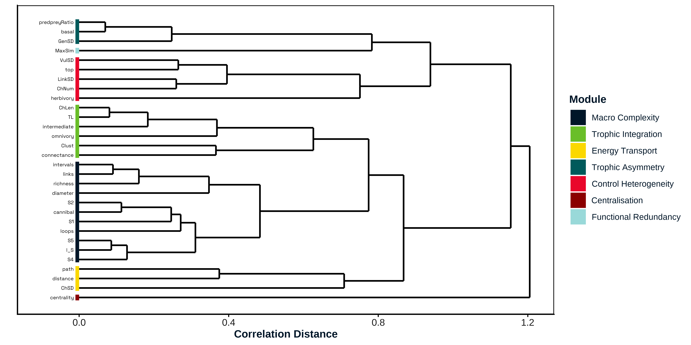
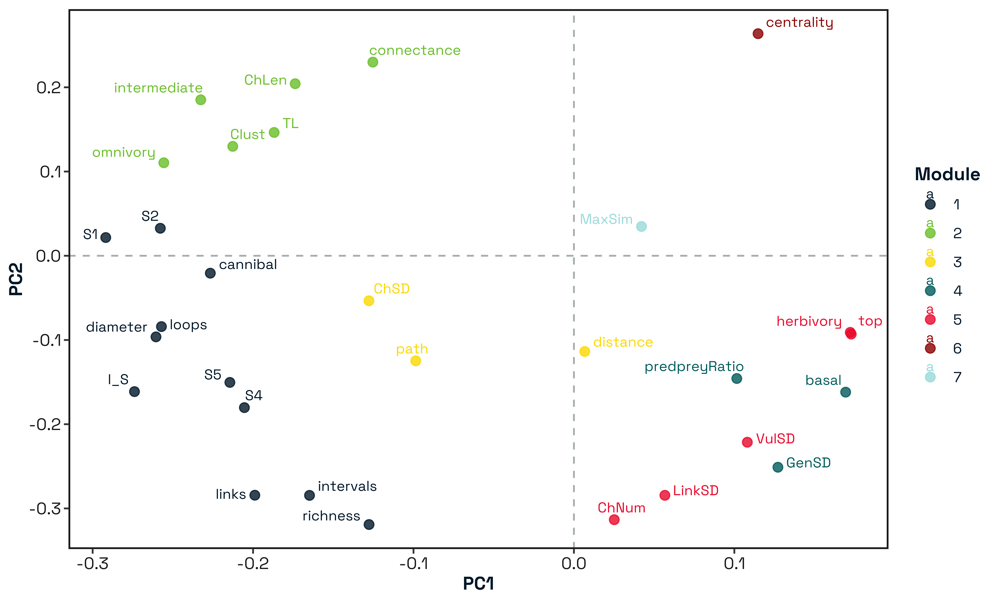
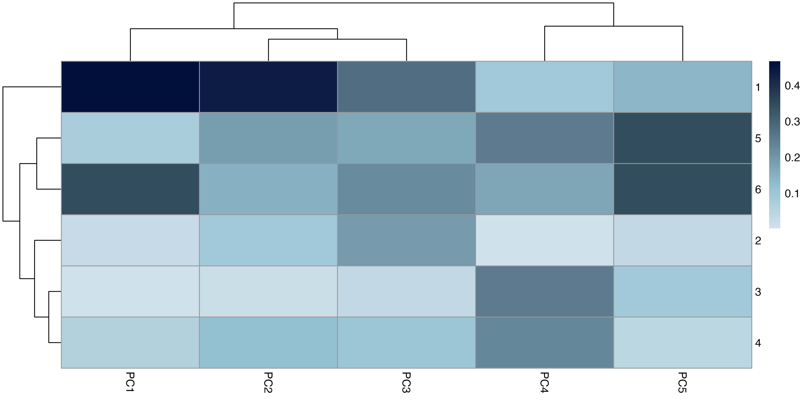

# Introduction

> Which metrics best represent the distinct stages of the energy-flow hierarchy, and do they capture different components of stability?

> Food web structure self-organises into process-level modules, and those modules govern different components of stability.

> Food web architecture is organised into emergent structural process modules, and different modules regulate different components of ecological stability.

> Food web metrics self-organise into structural process modules, these modules define network space, and different modules regulate different stability components.

> Should we be looking at if different metrics scale predictably with each other? 

Ecological networks are commonly characterised using a large and diverse set of structural metrics, yet there remains little consensus on how these metrics should be interpreted or compared across studies (Vermaat et al. 2009; Lau et al. 2017). We argue that this difficulty arises because network structure is not a single property, but a hierarchy of interrelated components that encode different aspects of how energy moves through an ecosystem (Ulanowicz 1986; Thompson et al. 2012). Metrics derived at different structural scales therefore capture different ecological processes and, consequently, relate to different components of stability. Making these distinctions explicit is essential for interpreting patterns of structure–stability relationships.

### Structural scale and the organisation of energy flow

We conceptualise food-web structure as organised across four hierarchical structural scales: node-level, path-level, network geometry, and emergent system behaviour (Pimm 1982; Cohen et al. 1990; Vermaat et al. 2009). These scales reflect increasing levels of integration, progressing from individual species roles to whole-network dynamics.

**Node-level structure:** describes the properties and roles of individual species within the network. Metrics such as trophic position, basal and top species proportions, centrality, and trophic similarity capture how energy enters the system, which species process or redistribute that energy, and the degree of functional redundancy among taxa (Yodzis & Winemiller 1999; Estrada 2007; Allesina & Pascual 2009). At this scale, structure primarily reflects who participates in energy transfer and whether alternative species can compensate for local losses, a long-standing mechanism proposed to underpin persistence in complex ecosystems (McCann 2000).

**Path-level structure**: describes how energy is routed through sequences of interactions linking species. Metrics such as food chain length, omnivory, motifs, loops, and prey–predator ratios capture the coupling of energy channels and the multiplicity of pathways connecting basal resources to higher trophic levels (Pimm & Lawton 1977; McCann et al. 1998; Stouffer & Bascompte 2011). This scale reflects how energy moves through the network and how perturbations may be transmitted across species, with particular pathway configurations either amplifying or diffusing disturbance effects (Neutel et al. 2002; Rooney et al. 2006).

**Network geometry**: captures the global arrangement and constraints of interactions, including link density, connectance, clustering, modularity, intervality, and network distances (Dunne et al. 2002; Stouffer et al. 2006; Delmas et al. 2019). These properties define the overall “shape” of the food web and constrain which pathways are available for energy flow. Geometric organisation has been shown to influence the containment of perturbations, for example through compartmentalisation that limits the spread of local disturbances [@stoufferCompartmentalizationIncreasesFoodweb2011].

**Emergent system-level behaviour**: reflects the collective dynamical properties that arise from the interaction of nodes, paths, and geometry. Metrics such as spectral radius, SVD complexity, and robustness capture properties that cannot be attributed to individual species or interactions alone, but instead describe the system’s overall capacity to absorb, reorganise, or amplify perturbations (May 1972; Staniczenko et al. 2013; Strydom et al. 2021).

Together, these structural scales form a causal hierarchy: species roles give rise to interaction pathways, which are embedded within a global network geometry, from which emergent dynamical behaviour arises.

### Stability as a multi-component property

Stability is often treated as a single outcome, yet ecological theory has long recognised that it comprises multiple, distinct components (Pimm 1984; Ives & Carpenter 2007). Here, we focus on three complementary stability mechanisms that are directly interpretable in terms of energy flow: persistence, resistance, and return.

**Persistence**: refers to the continued ability of the system to sustain energy flow following species loss or disturbance. Structures that promote redundancy, multiple basal inputs, and functional overlap among species enhance persistence by ensuring that energy can continue to enter and circulate within the network even when individual components are removed (McCann 2000; Dunne et al. 2002; Jonsson et al. 2015).

**Resistance**: describes the extent to which perturbations are attenuated or contained rather than propagating through the network. Path-level structures such as omnivory, short chains, motifs, and modular organisation can diffuse or localise disturbances, reducing the likelihood that local perturbations escalate into system-wide effects (McCann et al. 1998; Neutel et al. 2002; Stouffer & Bascompte 2011).

**Return**: captures the capacity of the system to reorganise or recover following disturbance, including the re-establishment of interaction pathways and the damping of oscillations. Emergent properties linked to global organisation and heterogeneity, such as spectral radius and structural complexity, reflect constraints on system-wide dynamics and influence the speed and manner with which a system returns to equilibrium or a new stable configuration (May 1972; Ulanowicz 2001; Staniczenko et al. 2013).

Crucially, these stability components operate at different structural scales and are not expected to respond uniformly to the same network properties.

### Implications for interpreting network metrics

Within this framework, metrics that are often treated as competing predictors of 'stability' instead emerge as complementary descriptors of different stability mechanisms [@thompsonFoodWebsReconciling2012]. Node-level metrics primarily relate to persistence, path-level metrics to resistance, and global organisational metrics to return dynamics. Some descriptors span multiple scales, reflecting the coupling between structural organisation and emergent behaviour (Allesina & Tang 2012).

This perspective provides a mechanistic explanation for why studies using different network metrics frequently report contrasting structure–stability relationships. Rather than reflecting inconsistency or redundancy, these differences arise because different metrics implicitly target different components of stability [@lauEcologicalNetworkMetrics2017]. By explicitly linking structural scale, energy flow, and stability mechanism, this framework provides a principled basis for interpreting network metrics and for selecting descriptors that align with specific ecological questions.

| Structural scale | What it encodes | Energy-flow interpretation | Stability component |
|------------------|------------------|------------------|------------------|
| Node | Species roles and redundancy | Who handles energy | Persistence (can energy still enter and move?) |
| Path | Energy routing and coupling | How energy moves | Resistance (does disturbance spread?) |
| Geometry | Network constraints and organisation | Where energy can go | Containment / buffering |
| Behaviour | Emergent dynamics | How energy reorganizes | Return / reassembly |

: Words

# Materials & Methods

## Data Compilation

We compiled quantitative network data from XX, resulting in a total of XX ecological networks. Each network was characterized using a suite of XX structural metrics [@tbl-properties], including classic descriptors such as richness, connectance, and modularity, as well as information-theoretic measures like spectral radius and SVD complexity. Prior to analysis, networks with missing values were omitted, and all metrics were standardized (mean = 0, SD = 1) to account for differences in scale and units across descriptors.

| Label | Definition | Structural interpretation | Reference |
|-----------------|-----------------|-----------------------|-----------------|
| Basal | Proportion of taxa with zero vulnerability (no consumers). | Quantifies the proportion of species representing basal energy inputs to the network. |  |
| Top | Proportion of taxa with zero generality (no resources). | Describes the relative prevalence of terminal consumers in the network. |  |
| Intermediate | Proportion of taxa with both consumers and resources. | Captures the proportion of species participating in both upward and downward energy transfer. |  |
| Richness (S) | Number of taxa (nodes) in the network. | Describes network size. |  |
| Links (L) | Total number of trophic interactions (edges). | Describes interaction density independent of network size. |  |
| Connectance | $L/S^2$, where $S$ is the number of species and $L$ the number of links | Measures the proportion of realised interactions relative to all possible interactions. | Dunne et al. 2002 |
| L/S | Mean number of links per species. | Captures average interaction density per taxon. |  |
| Cannibal | Proportion of taxa with self-loops. | Quantifies the prevalence of cannibalistic interactions. |  |
| Herbivore | Proportion of taxa feeding exclusively on basal species. | Describes the representation of primary consumers. |  |
| Intermediate | Percentage of intermediate taxa (with both consumers and resources) |  |  |
| Trophic level (TL) | Prey-weighted trophic level averaged across taxa. | Captures the vertical organisation of energy transfer. | @williamsLimitsTrophicLevels2004 |
| MaxSim | Mean maximum trophic similarity of each taxon to all others. | Quantifies functional similarity based on shared predators and prey. | @yodzisSearchOperationalTrophospecies1999 |
| Centrality | Node centrality averaged across taxa (definition-dependent). | Captures the distribution of influence or connectivity among species. | @estradaUsingNetworkCentrality2008 |
| ChLen | Mean length of all food chains from basal to top taxa. | Describes the average number of steps in energy-transfer pathways. |  |
| ChSD | Standard deviation of food chain length. | Captures variability in pathway lengths. |  |
| ChNum | Log-transformed number of distinct food chains. | Quantifies the multiplicity of alternative energy pathways. |  |
| Path | Mean shortest path length between all species pairs. | Describes the average distance between taxa within the network. |  |
| Diameter | Maximum shortest path length between any two taxa. | Captures the largest network distance between species. |  |
| Omnivory | Proportion of taxa feeding on resources at multiple trophic levels. | Describes vertical coupling of energy channels. | @mccannDiversityStabilityDebate2000 |
| Loop | Proportion of taxa involved in trophic loops. | Quantifies the prevalence of cyclic interaction pathways. |  |
| Prey:Predator | Ratio of prey taxa (basal + intermediate) to predator taxa (intermediate + top). | Describes the overall shape of the trophic structure. |  |
| Diameter | Diameter can also be measured as the average of the distances between each pair of nodes in the network |  |  |
| Clust | Mean clustering coefficient. | Measures the tendency for taxa sharing interaction partners to also interact with each other. | @wattsCollectiveDynamicsSmallworld1998 |
| GenSD | Normalised standard deviation of generality. | Captures heterogeneity in the number of resources per taxon. | @williamsLimitsTrophicLevels2004 |
| VulSD | Normalised standard deviation of vulnerability. | Captures heterogeneity in the number of consumers per taxon. | @williamsLimitsTrophicLevels2004 |
| LinkSD | Normalised standard deviation of total links per taxon. | Quantifies variation in species connectivity. |  |
| Intervality | Degree to which taxa can be ordered along a single niche dimension. | Measures the extent of niche ordering in trophic interactions. | @stoufferRobustMeasureFood2006a |
| ρ (Spectral radius) | Largest real part of the eigenvalues of the undirected adjacency matrix. | Captures a global property of network organisation related to interaction strength aggregation. |  |
| Complexity (SVD) | Shannon entropy of the singular value decomposition of the adjacency matrix. | Quantifies heterogeneity in interaction structure. | @strydomSVDEntropyReveals2021 |
| Robustness | Proportion of secondary extinctions following primary species removal. | Operational measure of tolerance to node loss. | @jonssonReliabilityR50Measure2015 |
| S1 (Linear chain) | Frequency of three-node linear chains (A → B → C) with no additional links. | Captures the prevalence of simple, unbranched energy-transfer pathways. | @stoufferEvidenceExistenceRobust2007 @miloNetworkMotifsSimple2002 |
| S2 (Omnivory) | Frequency of three-node motifs forming a feed-forward loop (A → B → C, A → C). | Describes vertical coupling of trophic levels within small subnetworks. | @stoufferEvidenceExistenceRobust2007 @miloNetworkMotifsSimple2002 |
| S4 (Apparent competition) | Frequency of motifs where one consumer feeds on two resources (A → B ← C). | Captures the prevalence of shared-predator structures among resources. | @stoufferEvidenceExistenceRobust2007 @miloNetworkMotifsSimple2002 |
| S5 (Direct competition) | Frequency of motifs where two consumers share a single resource (A ← B → C). | Describes the occurrence of shared-resource structures among consumers. | @stoufferEvidenceExistenceRobust2007 @miloNetworkMotifsSimple2002 |

: An informative caption about the different network properties. We use a combination of metrics from both the original @vermaatMajorDimensionsFoodweb2009 paper as well as including those that have been identified by @thompsonFoodWebsReconciling2012 and have been linked to emerging ecosystem properties such as stability {#tbl-properties}

## Identification of Structural Modules

We tested the hypothesis that structural descriptors of food webs are organised into statistically coherent modules reflecting shared ecological function or scaling relationships, rather than forming arbitrary clusters driven by sampling noise.
If such modular organization exists, then metrics within a module should exhibit strong internal correlation relative to metrics assigned to different modules. The resulting clusters should be robust to resampling of the data. The identified modular structure should exceed expectations under null models of random association among metrics.

We quantified pairwise associations among the 30 structural metrics using Pearson correlations computed across food webs. Because ecological metrics may covary either positively or negatively depending on scaling relationships, we constructed two alternative distance matrices: $1−r$, which preserves the sign of correlations and distinguishes positive from negative association and $1−∣r∣$, which groups variables based on the magnitude of their association regardless of sign. These two definitions allow us to test whether modular structure depends on directional relationships or simply on the strength of coupling among metrics. Hierarchical clustering was performed using average linkage on each distance matrix to identify candidate structural modules.

The optimal number of clusters was evaluated across a range of partition sizes (k = 2–10) using average silhouette width to assess within-cluster cohesion and between-cluster separation. To further evaluate cluster robustness, we implemented bootstrap resampling with 1,000 bootstrap replicates. This procedure estimates approximately unbiased (AU) p-values for each cluster, quantifying the probability that a cluster is supported under repeated resampling of the data. Clusters were considered statistically robust when they exhibited high silhouette support, and approximately unbiased bootstrap support ≥ 0.95. This dual criterion ensures that identified modules are both structurally coherent and stable to sampling variation.

## Multivariate Structure and Module–Axis Alignment

To evaluate whether structural metrics of food webs organize into coherent multivariate modules and whether those modules define principal axes of variation, we conducted a principal component analysis (PCA) followed by a permutation-based test of module–axis alignment. Under this framework, principal components define dominant structural gradients in the metric space, whereas modules represent hypothesised mechanistic groupings of structurally related metrics. Demonstrating alignment between these two representations would suggest that modular decomposition captures fundamental axes of ecological variation.

Skewed count-based metrics (*e.g.,* link counts, interval counts, and related quantities) were log-transformed using $log(x + 1)$ to reduce right skew. All remaining variables were standardized to zero mean and unit variance prior to analysis to ensure that metrics measured on different scales contributed equally to the ordination.

To quantify how structural modules align with principal axes, we decomposed variance in each principal component according to module membership. For each module $m$ and principal component $k$, we computed:

$$ 
A_{mk} = \sum_{i \in m} l^{2}_{ik}
$$

where $l_{ik}$  is the loading of metric $i$ on principal component $k$ and $A_{mk}$ represents the fraction of variance in PC 
$k$ attributable to metrics in module $m$. Because squared loadings sum to one within each principal component, this provides a direct partitioning of PC variance across modules. This produces a module × PC matrix describing geometric alignment between modular structure and multivariate axes.

To evaluate whether observed module–PC alignment exceeded expectations under random module structure, we implemented a permutation test. We randomly permuted module labels among metrics 1 000 times while preserving the number and size distribution of modules, and the PCA loadings. For each permutation $r$, we recomputed $A^{(r)}_{mk}$ so as to form a null distribution for each module–PC pair. From this we computed p-values and corresponding z-scores, which was then used to infer significant alignment when $p_{mk} < 0.05 \land |Z_{mk}| > 1.96$

$$ 
p_{mk} = P(A^{(r)}_{mk} > A_{mk})
$$

$$ 
Z_{mk} = \frac{A_{mk} - \mu_{mk}}{\sigma_{mk}}
$$

Additionally we also evaluated if modules collectively aligned with PCA structure beyond random expectation. Overall concentration of variance within module–PC space was calculated as $T = \sum_{m, k} A^{2}_{mk}$ and significance was determined by comparing the observed ($T$) the permutation distribution ($T^{(r)}$). Where $p_{global} = P(T^{(r)} \geq T)$. A significant result indicates that module structure explains multivariate variance better than random groupings.

# Results

## Structural Metrics Organise into Robust Modules

Hierarchical clustering of structural descriptors revealed clear modular organisation within food-web architecture [@fig-cluster]. Silhouette analysis indicated an optimal partition of the signed correlation matrix at k=7 modules, with a maximum average silhouette width of [insert value]. Clustering based on absolute correlations produced a slightly coarser but comparable solution (k=5), demonstrating that the modular structure is robust to the treatment of correlation sign and reflects strong underlying association patterns among metrics.

{#fig-cluster}

Bootstrap resampling further supported the stability of the major clusters. Most principal modules exhibited high approximately unbiased (AU) support values (AU ≥ [insert value]), indicating that the identified clusters are not artefacts of sampling variability but represent statistically robust groupings of structural descriptors.

The resulting modular partition identified coherent groups of metrics describing distinct aspects of network architecture. These included a large-scale architectural module integrating size and motif-based descriptors, modules capturing trophic organisation and energy routing, and two modules consisting of isolated structural descriptors that function independently from broader metric groupings. Importantly, the modular structure persisted after accounting for species richness, demonstrating that clustering was not driven solely by network size effects.

## Modular Decomposition of Structural Space

The seven-module solution revealed a hierarchical decomposition of structural space into interpretable architectural dimensions. Collectively, the module decomposition reveals that food web structure can be interpreted as statistically supported and ecologically interpretable dimensions of network organisation that is strongly suggestive of a delineation by hierarchical architecture.

**Macro-Architectural Complexity:** The largest module encompassed species richness, number of interactions, diameter, motif frequencies, intervality, and related descriptors. These metrics jointly describe large-scale expansion of the interaction network and increased combinatorial complexity as species richness increases. This module reflects macro-architectural scaling: increasing network size simultaneously expands motif diversity, path structure, and global trophic ordering.

**Trophic Integration:** A second module grouped metrics describing vertical trophic organisation and connectivity, including connectance, trophic level, omnivory, chain length, and clustering. Together, these descriptors quantify how densely and hierarchically energy and interactions are embedded across trophic strata. This module captures the degree to which the network integrates trophic levels through cross-level interactions and structural embedding.

**Energy Transport:** A distinct module isolated geometric descriptors of interaction pathways, including mean distance, path number, and dispersion in chain length. These metrics characterize the structural geometry of energy routing independent of overall network size. The separation of this module suggests that routing structure constitutes an independent dimension of architectural variation rather than merely scaling with complexity.

**Trophic Asymmetry:** Another module captured metrics describing structural imbalance between basal and consumer components, including the proportion of basal species, predator–prey ratios, and generality measures. This module reflects bottom-heavy versus top-heavy structural skew and quantifies asymmetry in the distribution of trophic roles across the network.

**Control Heterogeneity:** A separate module grouped descriptors of heterogeneity in consumer pressure and top-down control, including the proportion of apex species, herbivory structure, and variance in vulnerability. This module captures variation in how evenly or unevenly control is distributed across trophic levels.

**Centralisation and Functional Redundancy:** Two metrics formed independent modules. Centrality emerged as a standalone module, representing concentration of structural dominance within a subset of species. Maximum trophic similarity likewise formed an isolated module, quantifying functional redundancy and niche overlap. The separation of these descriptors from broader structural groupings indicates that dominance concentration and trophic redundancy represent independent axes of food-web organisation.

Collectively, these seven modules delineate a hierarchical decomposition of food-web structure spanning macro-scale complexity, vertical integration, routing geometry, trophic imbalance, control heterogeneity, dominance concentration, and functional overlap.

| Module Name | Metrics Included | Ecological Interpretation | Robustness (Silhouette / AU) | Module Size |
|-------------|----------------|--------------------------|----------------------------|------------|
| Macro-Architectural Complexity | richness, links, diameter, motif frequencies, intervality, path-related metrics | Captures large-scale expansion of network structure and combinatorial complexity associated with increasing system size |  |  |
| Trophic Integration | connectance, trophic level, omnivory, chain length, clustering | Describes vertical trophic embedding and density of cross-level interactions |  |  |
| Energy Transport | mean distance, path number, chain-length dispersion | Quantifies geometric structure of energy routing independent of size scaling |  |  |
| Trophic Asymmetry | basal proportion, predator–prey ratio, generality | Represents structural skew between basal and consumer dominance; bottom-heavy vs top-heavy organization |  |  |
| Control Heterogeneity | apex proportion, herbivory, vulnerability variance | Captures heterogeneity in top-down control and uneven distribution of interaction pressure |  |  |
| Centralisation | centrality | Measures concentration of structural dominance within a subset of species |  |  |
| Functional Redundancy | maximum trophic similarity | Quantifies trophic overlap and niche redundancy; independent axis of functional equivalence |  |  |

: Structural Modules Identified From Hierarchical Clustering. {#tbl-modules}

## Structural Modules Align with Dominant Axes of Network Variation

Principal component analysis of standardised structural metrics revealed strong dimensional compression in food-web structure [@fig-pca]. The first three principal components accounted for 69.1% of total variance (PC1 = 31.2%, PC2 = 22.4%, PC3 = 15.4%), with 80.8% of variance explained by the first five components. Subsequent axes contributed progressively smaller proportions of variance, indicating that a small number of dominant gradients summarise most structural variation.

{#fig-pca}

Inspection of the loading structure showed that the first principal component primarily reflected variation in network size and connectivity. Metrics such as richness, number of links, diameter, path length, and measures associated with topological complexity loaded strongly on this axis. The second principal component captured variation associated with structural organization and connectivity patterns, whereas the third component reflected variation in trophic structure and vertical differentiation, with strong contributions from trophic level, chain length, and related measures. Together, these axes represent interpretable structural gradients in the metric space.

{#fig-alignment_heatmap}

The global permutation test indicated significant alignment between modules and principal components (P = 0.005), demonstrating that the observed modular partition explains the multivariate geometry of structural metrics better than randomly assigned modules. Module 1 exhibited the strongest and most extensive alignment with principal components, showing significant associations across seven axes and with its strongest alignment occurring on PC1. This module therefore contributes substantially to the dominant structural gradient and captures variation associated with network size and connectivity. Module 3 showed significant alignment with four principal components, with its strongest association on PC4, suggesting that it captures structural variation orthogonal to the primary complexity gradient. Modules 2, 4, 5, 6, and 7 displayed more limited alignment, each showing significance with fewer principal components. Notably, Module 2 aligned most strongly with a later principal component (PC19), indicating that it captures a more subtle structural axis that contributes modestly to overall variance but remains statistically distinct from random expectation. Across modules, significant alignments were concentrated in a subset of principal components, reinforcing the interpretation that modular structure maps onto specific structural gradients rather than uniformly spanning the full multivariate space.

> I have an idea for this result...

Collectively, these results demonstrate that food-web structural metrics exhibit strong low-dimensional organisation and that independently identified structural modules are non-randomly aligned with the dominant axes of variation. The significant global alignment supports the interpretation that modular decomposition reflects meaningful geometric structure rather than clustering artifacts. Moreover, the dominance of a single module across multiple principal components suggests hierarchical organisation, wherein a core structural module governs the primary gradient of variation while additional modules capture secondary and specialised structural dimensions.

# Discussion

## Why consensus on “the best metric” has remained elusive

For more than four decades, the structure–stability debate has oscillated between competing structural descriptors, from connectance and complexity to modularity, omnivory, and trophic redundancy. Early theoretical work, most notably by May, suggested that increasing complexity should destabilise large systems, placing global descriptors such as connectance and interaction density at the centre of the debate. Subsequent empirical and theoretical studies, however, demonstrated stabilising roles for omnivory, weak links, and compartmentalisation (e.g. McCann; Dunne), shifting attention toward pathway-level and geometric properties. Our results suggest that this apparent inconsistency does not arise because some metrics are “wrong,” but because they capture different dimensions of a fundamentally multi-layered architecture. Food-web structure is not a single axis ranging from simple to complex; it is a high-dimensional space in which node composition, pathway routing, geometric constraint, and emergent organisation vary semi-independently. Metrics that have historically been treated as competitors—such as richness, connectance, omnivory, and redundancy—are in fact anchors of distinct structural dimensions. This explains why no single metric consistently predicts “stability” across studies: stability itself is not singular. When studies measure persistence (e.g. secondary extinctions), node-level balance and redundancy dominate. When they measure local stability or damping, path-level coupling and basal channel dominance matter more. When they measure recovery or informational organisation, global heterogeneity and role differentiation become decisive. The search for a universal structural predictor of stability has therefore been misguided—not because structure is unimportant, but because both structure and stability are multidimensional.

## Reconciling contrasting structure–stability relationships

A persistent challenge in the literature has been that similar metrics sometimes show opposite associations with stability. For example, omnivory has been reported as stabilising in some contexts and destabilising in others. Within our framework, this variability is expected. Path-level coupling (e.g. omnivory motifs) primarily relates to resistance—the containment or diffusion of perturbations—rather than persistence per se. A structure that dampens oscillations may not prevent extinction cascades, and vice versa. Similarly, our finding that richness contributes substantially to structural variance but fails to predict any stability component underscores an important decoupling: network size is not synonymous with robustness. This result aligns with empirical syntheses showing that species richness alone poorly predicts secondary extinction resistance unless accompanied by trophic balance or redundancy. In our analyses, the predator–prey ratio and herbivory—metrics reflecting trophic shape and basal channel dominance—were far stronger determinants of persistence and damping than richness itself. This helps reconcile why biodiversity–stability studies sometimes find positive, neutral, or context-dependent relationships. Richness operates primarily as a geometric scaling variable. Its effect on stability depends on how additional species alter the configuration of energy channels—whether they add redundancy, elongate chains, skew trophic balance, or increase coupling. Without specifying which structural dimension richness modifies, its stability effect is indeterminate.

## Implications for biodiversity–stability theory

Our results contribute to a long-standing tension between the “complexity begets instability” argument and more recent views that diversity enhances resilience. The resolution lies in recognising that different dimensions of complexity influence different stability components. Redundancy and trophic similarity (low MaxSim heterogeneity) enhance persistence by providing functional compensation following species loss. Pathway multiplicity and basal channel dominance regulate resistance by shaping how perturbations propagate. Global organisational heterogeneity (captured by SVD complexity and spectral properties) influences return dynamics by constraining system-wide oscillations and reassembly patterns. In this sense, complexity is neither inherently stabilising nor destabilising. Instead, distinct forms of complexity map onto distinct dynamical outcomes. Connectance, motif structure, redundancy, and informational heterogeneity are not interchangeable proxies for “complexity,” but structurally and mechanistically distinct attributes. By explicitly embedding food-web metrics within an energy-flow hierarchy, our framework reframes biodiversity–stability theory. Stability emerges not from species number alone, but from the configuration of energy channels and the distribution of functional roles across those channels. A bottom-heavy web with balanced predator–prey ratios and differentiated trophic niches may achieve both persistence and damping, even at moderate richness. Conversely, a species-rich but top-heavy or weakly differentiated web may remain fragile.

## Structural modularity and the minimum sufficient set

A key practical outcome of our analysis is the identification of six structural pillars that capture nearly 85% of the variation in network architecture. Despite starting with 31 commonly used metrics, much of their variance collapses into a smaller number of independent axes. Hierarchical clustering further revealed robust modules corresponding to trophic balance, pathway structure, geometric scale, and redundancy. This dimensional reduction has two important implications. First, it demonstrates that many commonly reported metrics are statistically redundant. Reporting both connectance and L/S, or multiple correlated distance measures, adds little new information. Second, it provides a principled route toward a minimum sufficient descriptor set tailored to ecological questions. Rather than selecting metrics by convention, researchers can select representatives of the relevant structural scale.

## Guidance for metric choice based on ecological question

If the question concerns extinction cascades or tolerance to species loss (persistence): prioritise node-level balance and redundancy metrics (e.g. predator–prey ratio, herbivory, similarity). If the question concerns perturbation propagation or damping (resistance): focus on path-level and basal-channel metrics (e.g. pathway multiplicity, omnivory, mean distance). If the question concerns recovery dynamics or organisational reassembly (return): emphasise global heterogeneity and spectral measures (e.g. SVD complexity, spectral radius). If the question concerns comparative architecture across systems: use geometric anchors (e.g. richness) but interpret them as scale descriptors rather than stability predictors. This scale-explicit approach shifts the emphasis from asking “Which metric best predicts stability?” to “Which structural dimension corresponds to the stability mechanism of interest?”

## Limitations and future directions

While our framework clarifies structural dimensionality, it remains grounded in static network topology. Real ecosystems exhibit interaction strengths, temporal variability, adaptive rewiring, and environmental forcing. Incorporating weighted networks and dynamic simulations would strengthen the mechanistic link between structural axes and realised dynamics. Additionally, the separation of persistence, resistance, and return is analytically useful but biologically intertwined. For example, structures that enhance resistance may indirectly support persistence by preventing large cascades. Future work could explore how these components interact across environmental gradients and disturbance regimes. Finally, extending this framework beyond trophic networks to mutualistic, host–parasite, or multilayer networks would test its generality. The energy-flow hierarchy proposed here may represent a broader organising principle of ecological interaction systems.

# Conclusion

Food-web stability is not governed by a single structural property, but by multiple, hierarchically organised dimensions of network architecture. Node composition, pathway routing, geometric constraint, and emergent organisation each represent distinct levers through which ecosystems maintain persistence, resist perturbation, and reorganise following disturbance.

By explicitly mapping structural scale to stability mechanism, we reconcile decades of seemingly conflicting findings in the structure–stability literature. The key insight is not that one metric is superior, but that different metrics answer different ecological questions. Recognising and embracing this multidimensionality provides a coherent foundation for future biodiversity–stability research and a practical framework for selecting network descriptors based on mechanism rather than tradition.

| Dimension | Key Metrics | Expected Effect on Stability | Supporting Literature |
|-----------------|-----------------|---------------------|-----------------|
| Complexity & Redundancy | Connectance, MaxSim, Links | **Positive:** High redundancy allows for 'functional compensation' if one species is lost. | @dunneFoodwebStructureNetwork2002; @mccannDiversityStabilityDebate2000 |
| Compartmentalization | Clust, Modularity, ρ | **Positive:** Limits the spread of perturbations; local collapses don't become global. | @stoufferCompartmentalizationIncreasesFoodweb2011 |
| Feedback & Coupling | Omnivory (S2), Loop, ChLen | **Variable:** Omnivory can stabilize by diffusing energy, but long chains can amplify oscillations. | @mccannDiversityStabilityDebate2000; @neutelStabilityRealFood2002 |
| Hierarchy & Shape | Prey:Predator, Basal, Top | **Critical:** 'Bottom-heavy' systems are generally more stable; inverted pyramids are fragile. |  |
| Information Heterogeneity | SVD Complexity, LinkSD | **Positive:** Diverse interaction strengths prevent 'resonant' instabilities. | @ulanowiczInformationTheoryEcology2001 |

: Network properties used for analysis. {#tbl-metrics}

To better link network structure to ecosystem function, we grouped commonly used food web metrics into four functional categories reflecting their ecological interpretation. Node-level metrics (e.g., basal, top, intermediate, herbivory, cannibal, trophic level, centrality, MaxSim) capture the roles and properties of individual species. Path-level metrics (*e.g.,* food chain lengths, motifs, omnivory, loops, prey-to-predator ratios) describe how energy and interactions flow through the network. Geometry metrics (e.g., connectance, link density, clustering, variation in links, diameter, intervality, spectral radius, SVD complexity) quantify the overall network arrangement and topological organization. Finally, behavioural/system-level metrics (e.g., robustness, spectral radius, SVD complexity) capture emergent properties such as resilience, redundancy, and dynamic stability. This framework provides a transparent, ecologically interpretable mapping from species-level roles and interaction paths to system-level behaviour, facilitates identification of a Minimum Sufficient Set of descriptors, and links network structure to long-standing questions in the stability–complexity debate.

| Category | Metrics | Rationale |
|------------------------|------------------------|------------------------|
| Node-level | basal, top, intermediate, herbivory, cannibal, TL, centrality, MaxSim | Metrics describing individual species and their roles in the network, including trophic position (TL), feeding type (basal, herbivory, cannibal), influence (centrality), and functional redundancy (MaxSim). |
| Path level | ChLen, ChSD, ChNum, path, S1, S2, S4, S5, omnivory, loops, predpreyRatio, distance | Metrics describing energy flow or interaction paths through the network, including food chain lengths, motifs, omnivory, loops, and prey-predator ratios. Capture how energy and interactions move across nodes. |
| Geometry/topology | connectance, l_S, links, richness, Clust, GenSD, VulSD, LinkSD, diameter, intervals | Metrics describing **overall network structure**, including density (connectance, links, L/S), size (richness), local clustering, link asymmetry, network distances (diameter), and niche structure (intervals). Capture the ‘shape’ of the network. |
| Behaviour/system-level | ρ, complexity, robustness | Metrics describing emergent properties of the network, including system-wide stability, resilience, and structural complexity. Capture how the network responds to perturbations or organizes itself at a global level. |

: Classification of food web metrics into functional categories. Node-level metrics capture species roles; path-level metrics capture energy or interaction flows; geometry metrics describe network structure; and behaviour/system-level metrics capture emergent stability and resilience. {#tbl-classification}

# References {.unnumbered}

::: {#refs}
:::