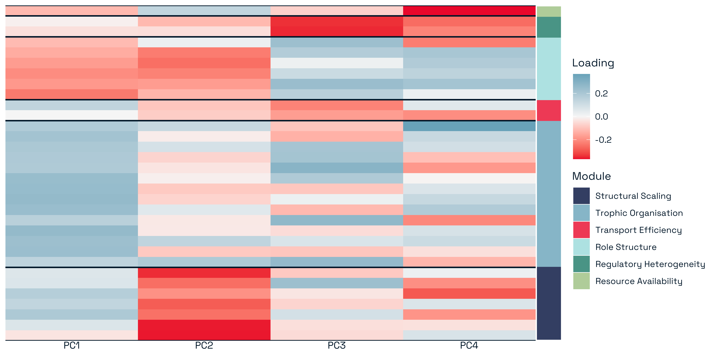
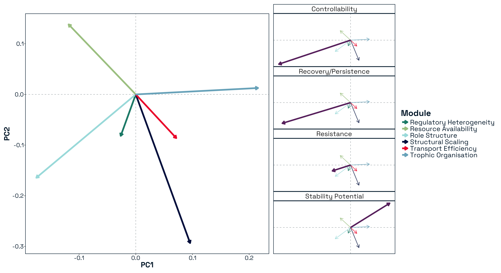

# Introduction

Ecological theory has long sought general principles linking the architecture of interaction networks to ecosystem stability. Early theoretical work framed this relationship in terms of system complexity, most famously through the analysis of random community matrices by Robert May, who showed that increasing species richness, interaction density, and interaction strength variance should reduce local dynamical stability in large ecological systems [@mayWillLargeComplex1972; @mayStabilityComplexityModel1974]. Subsequent work refined this prediction by demonstrating that specific forms of network organisation such as interaction structure, trophic hierarchy, and compartmentalisation can substantially alter stability outcomes [@mccannDiversityStabilityDebate2000; @allesinaStabilityCriteriaComplex2012; @stoufferUnderstandingFoodwebPersistence2010]. More recently, structural theories such as trophic coherence have proposed that food webs occupy constrained regions of structural space in which particular architectural features strongly influence system stability [@johnsonTrophicCoherenceDetermines2014]. At the same time, ecological stability itself is now widely recognised as a multidimensional concept encompassing distinct dynamical properties such as persistence, resistance to disturbance, and recovery dynamics [@dominguez-garciaUnveilingDimensionsStability2019; @ivesStabilityDiversityEcosystems2007; @loreauBiodiversityEcosystemStability2013; @donohueNavigatingComplexityEcological2016; @chenStabilityEcologicalSystems2024]. Together these developments suggest that the relationship between network structure and ecological stability may be more complex than originally assumed, specifically that both structure and stability are multidimensional properties of ecological systems. If so, apparent inconsistencies in the structure–stability literature may arise not because theoretical predictions are incorrect, but because different studies measure different aspects of network architecture and different components of ecological stability.

Ecological networks are commonly characterised using a large and diverse set of structural metrics, yet there remains little consensus on how these metrics should be interpreted or compared across studies [@vermaatMajorDimensionsFoodweb2009; @lauEcologicalNetworkMetrics2017]. Measures of connectance, trophic level, modularity, omnivory, motif structure, and many others are routinely invoked as indicators of ecosystem organisation or stability. However, these descriptors often covary strongly, capture overlapping information, or reflect different scales of network organisation [@thompsonFoodWebsReconciling2012]. As a result, studies using different subsets of metrics frequently arrive at conflicting conclusions about the relationship between network structure and ecological stability. Rather than reflecting inconsistency or redundancy, these differences arise because different metrics implicitly target different components of stability [@lauEcologicalNetworkMetrics2017].

A key, but often implicit, assumption in this literature is that stability is defined primarily through the temporal behaviour of populations [@pimmComplexityStabilityEcosystems1984; @ivesStabilityDiversityEcosystems2007]. Here, we extend this view by considering stability not only as whether populations return to equilibrium, but whether the network that constrains those dynamics continues to exist and function. This perspective aligns with a broader view emerging across complex systems, in which stability is associated with the persistence of network structure and function under perturbation, including in financial systems, infrastructure networks, and social systems [@albertErrorAttackTolerance2000; @burleson-lesserKcoreRobustnessEcological2020]. This perspective is particularly relevant for empirical food webs, which are typically observed as static interaction networks and therefore encode structural constraints on dynamics rather than dynamics directly.

From this perspective, both the structure and stability of a network can be understood as multiscale properties. Structural metrics capture different aspects of how interactions are organised, from species-level roles to global network architecture, and should not be expected to provide universal predictors of stability [@newmanNetworksIntroduction2010]. Likewise, different stability components emerge from processes operating at different levels of organisation. Node-level properties relate to species persistence and redundancy [@dunneNetworkStructureBiodiversity2002], path-level structure governs the propagation of perturbations and thus resistance [@albertErrorAttackTolerance2000], and global network properties constrain system-wide behaviour and recovery potential [@mayWillLargeComplex1972; @allesinaStabilityCriteriaComplex2012].

Within this framework, commonly used metrics can be reinterpreted as complementary descriptors of distinct stability mechanisms rather than competing proxies for a single concept of stability. For example, controllability identifies influential species at the node level [@liuControllabilityComplexNetworks2011; @cowanNodalDynamicsNot2012], robustness to species loss captures the maintenance of connectivity under perturbation [@dunneNetworkStructureBiodiversity2002], subgraph structure reveals cohesive subcomponents of the network [@kitsakIdentificationInfluentialSpreaders2010], and emergent properties reflect emergent constraints on system-level dynamics [@allesinaStabilityCriteriaComplex2012]. Many of these metrics span multiple scales, linking local structure to global behaviour.

Adopting a multi-scale perspective may provide a mechanistic explanation for why different studies report contrasting structure–stability relationships. Rather than reflecting inconsistency, such differences arise because different metrics implicitly target different stability components operating at different organisational scales. Identifying whether commonly used metrics organise into a smaller set of coherent structural dimensions therefore offers a way to reduce redundancy while preserving ecological meaning.

Here we investigate whether the large number of structural metrics used to characterise food webs can be reduced to a smaller set of coherent structural dimensions, and whether these dimensions relate to different components of ecological stability. Using a compilation of empirical food webs, we quantified a broad suite of commonly used network descriptors spanning species roles, interaction pathways, and global network organisation. We first examined whether these metrics self-organise into statistically robust modules based on their covariation across ecosystems. We then evaluated how these modules align with dominant multivariate axes of structural variation. Finally, we compared alternative representations of network structure to assess how different structural dimensions relate to three stability properties: robustness to species loss, resilience, spectral radius, and controllability. By explicitly mapping the multivariate structure of network architecture to stability outcomes, this analysis provides a principled framework for interpreting network metrics and for selecting structural descriptors that match specific ecological questions.

{#fig-conceptual}

# Materials & Methods

## Data Compilation

We compiled food web data from Mangal [@poisotMangalMakingEcological2016], Web of Life [@fortunaWebLife2014], and the canonical networks used by @vermaatMajorDimensionsFoodweb2009, resulting in a total of XX networks. All networks were treated as binary and characterised using a suite of XX structural metrics (see @tbl-properties).

| Label | Definition | Structural interpretation | Reference |
|------------------|------------------|--------------------|------------------|
| Basal | Proportion of taxa with zero vulnerability (no consumers). | Quantifies the proportion of species representing basal energy inputs to the network. |  |
| Top | Proportion of taxa with zero generality (no resources). | Describes the relative prevalence of terminal consumers in the network. |  |
| Intermediate | Proportion of taxa with both consumers and resources. | Captures the proportion of species participating in both upward and downward energy transfer. |  |
| Richness (S) | Number of taxa (nodes) in the network. | Describes network size. |  |
| Links (L) | Total number of trophic interactions (edges). | Describes interaction density independent of network size. |  |
| Connectance | $L/S^2$, where $S$ is the number of species and $L$ the number of links | Measures the proportion of realised interactions relative to all possible interactions. | Dunne et al. 2002 |
| L/S | Mean number of links per species. | Captures average interaction density per taxon. |  |
| Cannibal | Proportion of taxa with self-loops. | Quantifies the prevalence of cannibalistic interactions. |  |
| Herbivore | Proportion of taxa feeding exclusively on basal species. | Describes the representation of primary consumers. |  |
| Trophic level (TL) | Prey-weighted trophic level averaged across taxa. | Captures the vertical organisation of energy transfer. | @williamsLimitsTrophicLevels2004 |
| MaxSim | Mean maximum trophic similarity of each taxon to all others. | Quantifies functional similarity based on shared predators and prey. | @yodzisSearchOperationalTrophospecies1999 |
| Centrality | Node centrality averaged across taxa (definition-dependent). | Captures the distribution of influence or connectivity among species. | @estradaUsingNetworkCentrality2008 |
| ChLen | Mean length of all food chains from basal to top taxa. | Describes the average number of steps in energy-transfer pathways. |  |
| ChSD | Standard deviation of food chain length. | Captures variability in pathway lengths. |  |
| ChNum | Log-transformed number of distinct food chains. | Quantifies the multiplicity of alternative energy pathways. |  |
| Path | Mean shortest path length between all species pairs. | Describes the average distance between taxa within the network. |  |
| Diameter | Maximum shortest path length between any two taxa. | Captures the largest network distance between species. |  |
| Omnivory | Proportion of taxa feeding on resources at multiple trophic levels. | Describes vertical coupling of energy channels. | @mccannDiversityStabilityDebate2000 |
| Loop | Proportion of taxa involved in trophic loops. | Quantifies the prevalence of cyclic interaction pathways. |  |
| Prey:Predator | Ratio of prey taxa (basal + intermediate) to predator taxa (intermediate + top). | Describes the overall shape of the trophic structure. |  |
| Clust | Mean clustering coefficient. | Measures the tendency for taxa sharing interaction partners to also interact with each other. | @wattsCollectiveDynamicsSmallworld1998 |
| GenSD | Normalised standard deviation of generality. | Captures heterogeneity in the number of resources per taxon. | @williamsLimitsTrophicLevels2004 |
| VulSD | Normalised standard deviation of vulnerability. | Captures heterogeneity in the number of consumers per taxon. | @williamsLimitsTrophicLevels2004 |
| LinkSD | Normalised standard deviation of total links per taxon. | Quantifies variation in species connectivity. |  |
| Intervality | Degree to which taxa can be ordered along a single niche dimension. | Measures the extent of niche ordering in trophic interactions. | @stoufferRobustMeasureFood2006 |
| S1 (Linear chain) | Frequency of three-node linear chains (A → B → C) with no additional links. | Captures the prevalence of simple, unbranched energy-transfer pathways. | @stoufferEvidenceExistenceRobust2007 @miloNetworkMotifsSimple2002 |
| S2 (Omnivory) | Frequency of three-node motifs forming a feed-forward loop (A → B → C, A → C). | Describes vertical coupling of trophic levels within small subnetworks. | @stoufferEvidenceExistenceRobust2007 @miloNetworkMotifsSimple2002 |
| S4 (Apparent competition) | Frequency of motifs where one consumer feeds on two resources (A → B ← C). | Captures the prevalence of shared-predator structures among resources. | @stoufferEvidenceExistenceRobust2007 @miloNetworkMotifsSimple2002 |
| S5 (Direct competition) | Frequency of motifs where two consumers share a single resource (A ← B → C). | Describes the occurrence of shared-resource structures among consumers. | @stoufferEvidenceExistenceRobust2007 @miloNetworkMotifsSimple2002 |
| trophicVar | Measure of how much the trophic positions of species deviate from the mean trophic level. | Variance is linked to chain length, with low variance indicating few long chains and high variance indicates long chains and varied interactions | @pimmFoodWebs1982 |
| TrophicCoherence | Measure how well the species in a food web fit into discrete trophic levels. | Highly coherent, neatly layered food webs are more stable to perturbations | @johnsonTrophicCoherenceDetermines2014 |

: An informative caption about the different network properties. We use a combination of metrics from both the original @vermaatMajorDimensionsFoodweb2009 paper as well as including those that have been identified by @thompsonFoodWebsReconciling2012 and have been linked to emerging ecosystem properties such as stability {#tbl-properties}

In addition to network structural descriptors, we quantified multiple complementary measures of ecological stability that capture distinct aspects of system response to perturbation. First, robustness to species loss ($R_{50}$) quantifies the proportion of primary extinctions required to reduce network richness to 50% of its initial value, providing a threshold-based measure of the system’s tolerance to species removal and its ability to maintain connectivity under perturbation [@dunneNetworkStructureBiodiversity2002; @jonssonReliabilityR50Measure2015]. Second, we quantify resilience as the area under the extinction curve, relating primary species loss to secondary extinctions, which captures how rapidly structural collapse propagates through the network as perturbations accumulate and thus reflects the rate of system degradation under sequential disturbance. Third, spectral radius ($\rho$), defined as the largest real part of the eigenvalues of the adjacency matrix[@staniczenkoGhostNestednessEcological2013] making it a proxy for network persistence [@bascompteNestedAssemblyPlantanimal2003]. This provides a global constraint on system behaviour and can be interpreted as a proxy for the system’s dynamical stability potential, governing the amplification or decay of perturbations. Finally, structural controllability quantifies the minimum number of driver species required to control the system’s dynamics, capturing the capacity for directed reorganisation following perturbation and identifying species that exert disproportionate influence on system behaviour [@liuControllabilityComplexNetworks2011]. Together, these metrics capture complementary aspects of ecological stability: (i) resistance to perturbation, quantified by robustness as tolerance to species loss; (ii) recovery/persistence after perturbation, measured as the propagation of cascading extinctions following sequential species removal; (iii) stability potential, captured by the spectral radius as a global constraint governing the amplification or decay of perturbations; and (iv) controllability, reflecting the minimum set of driver species required to steer system dynamics and reconfigure network structure. Because both robustness and resilience are dependent on stochastic extinctions we averaged these values from 100 extinction runs.

Finally, we incorporated two complementary measures that capture higher-order aspects of network organisation. First, we quantified complexity based on the singular value spectrum of the adjacency matrix. Specifically, we computed the entropy of the singular values obtained via singular value decomposition (SVD), which captures how structural variance is distributed across orthogonal modes. Networks with more evenly distributed singular values exhibit higher complexity, reflecting greater heterogeneity in interaction pathways and reduced dominance of any single structural mode [@strydomSVDEntropyReveals2021]. This provides a spectral analogue to traditional structural descriptors, linking network organisation to the distribution of interaction strength across latent dimensions.

Second, we included a composite scaling term of the form $-\frac{1}{2}(\log{(Richness)} + \log{(Connectance)})$ This term captures the joint scaling of network size and density and can be interpreted as a log-transformed geometric mean of these quantities. This formulation is motivated by classical stability results, where system behaviour depends on the combined scaling of species richness and interaction density, rather than either quantity in isolation. As such, this term provides a compact representation of size–complexity tradeoffs and complements both local (*e.g.,* degree distributions) and global (e.g., spectral) descriptors of network structure.

## Identification of Structural Modules

We tested the hypothesis that structural descriptors of food webs are organised into statistically coherent modules reflecting shared ecological function or scaling relationships, rather than forming arbitrary clusters driven by sampling noise. If such modular organisation exists, then metrics within a module should exhibit strong internal correlation relative to metrics assigned to different modules. The resulting clusters should be robust to resampling of the data. The identified modular structure should exceed expectations under null models of random association among metrics.

We quantified pairwise associations among the XX structural metrics using Pearson correlations computed across food webs. Because ecological metrics may covary either positively or negatively depending on scaling relationships, we constructed two alternative distance matrices: $1−r$, which preserves the sign of correlations and distinguishes positive from negative association and $1−∣r∣$, which groups variables based on the magnitude of their association regardless of sign. These two definitions allow us to test whether modular structure depends on directional relationships or simply on the strength of coupling among metrics. Hierarchical clustering was performed using average linkage on each distance matrix to identify candidate structural modules.

The optimal number of clusters was evaluated across a range of partition sizes ($k = 2–10$) using average silhouette width to assess within-cluster cohesion and between-cluster separation. To further evaluate cluster robustness, we implemented bootstrap resampling with 1,000 bootstrap replicates. This procedure estimates approximately unbiased (AU) p-values for each cluster, quantifying the probability that a cluster is supported under repeated resampling of the data. Clusters were considered statistically robust when they exhibited high silhouette support, and approximately unbiased bootstrap support ≥ 0.95. This dual criterion ensures that identified modules are both structurally coherent and stable to sampling variation.

## Multivariate Structure and Module–Axis Alignment

To evaluate whether structural metrics of food webs organise into coherent multivariate modules and whether those modules define principal axes of variation, we conducted a principal component analysis (PCA) followed by a permutation-based test of module–axis alignment. Under this framework, principal components define dominant structural gradients in the metric space, whereas modules represent hypothesised mechanistic groupings of structurally related metrics. Demonstrating alignment between these two representations would suggest that modular decomposition captures fundamental axes of ecological variation.

Skewed count-based metrics (*e.g.,* link counts, interval counts, and related quantities) were log-transformed using $log(x + 1)$ to reduce right skew. All remaining variables were standardised to zero mean and unit variance prior to analysis to ensure that metrics measured on different scales contributed equally to the ordination.

To quantify how structural modules align with principal axes, we decomposed variance in each principal component according to module membership. For each module $m$ and principal component $k$, we computed:

$$ 
A_{mk} = \sum_{i \in m} l^{2}_{ik}
$$

where $l_{ik}$ is the loading of metric $i$ on $PC_k$ and $A_{mk}$ represents the fraction of variance in $PC_k$ attributable to metrics in module $m$. Because squared loadings sum to one within each principal component, this provides a direct partitioning of PC variance across modules. This produces a module × PC matrix describing geometric alignment between modular structure and multivariate axes.

To evaluate whether observed module–PC alignment exceeded expectations under random module structure, we implemented a permutation test. We randomly permuted module labels among metrics 1 000 times while preserving the number and size distribution of modules, and the PCA loadings. For each permutation $r$, we recomputed $A^{(r)}_{mk}$ so as to form a null distribution for each module–PC pair. From this we computed p-values and corresponding z-scores, which was then used to infer significant alignment when $p_{mk} < 0.05 \land |Z_{mk}| > 1.96$

where:

$$ 
p_{mk} = P(A^{(r)}_{mk} > A_{mk})
$$

and:

$$ 
Z_{mk} = \frac{A_{mk} - \mu_{mk}}{\sigma_{mk}}
$$

Additionally we also evaluated if modules collectively aligned with PCA structure beyond random expectation. Overall concentration of variance within module–PC space was calculated as $T = \sum_{m, k} A^{2}_{mk}$ and significance was determined by comparing the observed ($T$) the permutation distribution ($T^{(r)}$). Where $p_{global} = P(T^{(r)} \geq T)$. A significant result indicates that module structure explains multivariate variance better than random groupings.

## Structural Metric Reduction and Representation of Network Space

To evaluate how network structure predicts ecological stability, we first reduced a high-dimensional set of topological metrics into alternative, biologically interpretable predictor sets. Because dimensionality reduction can fundamentally shape inference, we explicitly compared two conceptually distinct representations of network structure: (1) structural domain representatives and (2) latent axes of network variation.

### Identification of Structural Domains

We previously grouped network metrics into clusters based on their pairwise correlations, such that each cluster represented a structurally coherent domain (*e.g.,* trophic composition, centralisation, path structure). Clustering was performed using correlation-based distance, ensuring that metrics grouped together reflected shared structural information rather than raw scale. To construct a reduced predictor set from these domains, we selected a single representative metric per cluster using a medoid approach. Within each cluster, we computed the absolute correlation matrix among member metrics and defined distance as $1−∣r∣$. The medoid was identified as the metric minimising mean pairwise distance to other metrics in the cluster. This approach preserves structural diversity while minimising redundancy and does not rely on principal component loadings, which can bias selection toward dominant variance axes. The resulting 'cluster medoid' set retained one interpretable metric per structural domain. Importantly, this procedure prioritises preservation of structural domains rather than overall variance magnitude, allowing low-variance but potentially mechanistically relevant features of network topology to be retained.

### Extraction of Latent Structural Axes

As a complementary representation of network structure, we performed principal component analysis (PCA) on the scaled full metric matrix. Principal components were retained until cumulative explained variance exceeded 80%, yielding a set of orthogonal axes describing the dominant gradients of variation in network topology. These retained PC scores constitute a low-dimensional latent representation of network space. Unlike cluster medoids, which preserve structural categories, PC scores preserve maximal variance and ensure orthogonality among predictors. We also explored a third reduction approach—selecting the single highest-loading metric per retained PC. However, because principal components are linear combinations of multiple metrics, this PC-dominant metric strategy substantially reduces the variance represented by each axis. Consequently, this approach captures less of the total structural variance.

### Conceptual Contrast Between Representations

The cluster-medoid and PCA-score representations reflect different theoretical assumptions about how structure relates to stability. The cluster-medoid approach assumes that ecological stability responds to discrete structural domains that may vary independently and need not align with the dominant gradients of network variation. In contrast, the PCA-score approach assumes that stability responds primarily to the major axes of variation in network topology, regardless of their interpretability in terms of structural domains. By explicitly comparing predictive performance across these representations, we test whether ecological stability is better explained by domain-specific structural mechanisms or by global geometric gradients of network organisation.

## Structural Control of Stability

To evaluate how hierarchical representations of network structure explain variation in stability, we modelled four complementary stability outcomes: Robustness ($R_{50}$), Resilience, Spectral Radius ($\rho$), and Structural Controllability. These measures capture distinct dynamical processes governing ecosystem persistence, resistance, and controllability. Elastic net regression models were fit separately for each stability metric using three structural representations (cluster medoids, PC-dominant metrics, and full PCA scores) and XXX univariate, canonical proxies of stability (complexity, connectance, trophic coherence), allowing us to compare the structural determinants of different stability processes. All predictors and response variables were standardised prior to analysis to allow direct comparison of coefficient magnitudes.

Elastic net regularisation was chosen because it permits inference under correlated predictors by interpolating between ridge (distributed shrinkage) and lasso (sparse selection) penalties. The mixing parameter $\alpha$ (0–1) determines the degree of sparsity, with lower $\alpha$ values indicating distributed influence across many correlated structural descriptors (ridge-like behaviour), whereas higher $\alpha$ values indicate that stability is driven by a smaller subset of structural predictors (lasso-like sparsity).

### Model Evaluation

Predictive performance was assessed using repeated v-fold cross-validation (5 folds × 10 repeats) this improves the robustness of hyperparameter selection, particularly under correlated predictors and variable sample sizes. Repeating the partitioning reduces sensitivity to any single fold split and stabilises the selection of both $\alpha$ and $\lambda$, ensuring that the reported coefficients and variance contributions reflect consistent structural effects rather than idiosyncrasies of a particular data split. This approach enhances confidence that observed switching patterns in predictor importance across stability metrics represent genuine structural relationships rather than artefacts of sampling variability. Within each training partition, models were fit across a grid of $\alpha$ values (0–1 in increments of 0.25), and for each $\alpha$, the optimal penalty strength ($\lambda$) was selected via internal cross-validation on the training data. Specifically, $\lambda$ values were chosen from a dense path generated by the elastic net algorithm, and the $\lambda$ that maximised cross-validated $R^2$ within the training fold was recorded. This process ensured that $\lambda$ selection was independent of the held-out test data. Model performance was quantified as the mean cross-validated $R^2$ computed on held-out test partitions across all repeats and folds.

After cross-validation, final models were refit to the full dataset using the mean selected $\alpha$, and the λ value closest to the cross-validated optimum was used to extract standardised regression coefficients. These coefficients characterise the direction and relative magnitude of structural effects on each stability metric.

The primary objective was interpretation rather than predictive optimisation, with the aim to quantify how structural organisation governs different stability processes. The elastic net mixing parameter $\alpha$ provides insight into the architecture of structural control, indicating whether stability is influenced by many predictors (ridge-like) or a sparse subset (lasso-like). To quantify the relative contribution of different structural modules, standardised regression coefficients from the final models were squared and aggregated within modules. The proportion of variance explained by each module was then scaled by the model's cross-validated $R^2$, yielding a measure of the absolute variance in stability explained by each structural component.

# Results

## Structural Metrics Organise into Robust Modules

Hierarchical clustering of structural descriptors revealed clear modular organisation within food-web architecture [@fig-cluster]. Silhouette analysis indicated an optimal partition of the signed correlation matrix at k=7 modules, with a maximum average silhouette width of \[insert value\]. Clustering based on absolute correlations produced a slightly coarser but comparable solution (k=5), demonstrating that the modular structure is robust to the treatment of correlation sign and reflects strong underlying association patterns among metrics.

{#fig-cluster}

Bootstrap resampling further supported the stability of the major clusters. Most principal modules exhibited high approximately unbiased (AU) support values (AU ≥ \[insert value\]), indicating that the identified clusters are not artefacts of sampling variability but represent statistically robust groupings of structural descriptors.

The resulting modular partition identified coherent groups of metrics describing distinct aspects of network architecture [@fig-module]. These included a large-scale architectural module integrating size and motif-based descriptors, modules capturing trophic organisation and energy routing, and two modules consisting of more isolated structural descriptors that vary independently from broader groupings. The six-module solution [@fig-module] reveals a hierarchical decomposition of food-web structural space into interpretable ecological dimensions. Importantly, these modules can be understood not only as statistical groupings, but as reflecting successive constraints operating during network assembly. Early-emerging dimensions associated with network size and interaction density define the combinatorial space of possible interactions, consistent with classical complexity arguments in which system behaviour is governed by its size [@mayWillLargeComplex1972; @allesinaStabilityCriteriaComplex2012]. At this level, network structure largely reflects statistical constraints on degree distributions, as captured by null and configuration models [@newmanNetworksIntroduction2010]. In contrast, higher-order modules capture constraints imposed by trophic organisation, energy flow, and species roles, reflecting ecological structuring processes described by niche-based and trophic theories of food-web assembly [@williamsSimpleRulesYield2000; @stoufferUnderstandingFoodwebPersistence2010; @johnsonTrophicCoherenceDetermines2014]. Collectively, this structure indicates that food-web organisation arises from multiple, partially independent axes of variation that correspond to distinct constraints operating during network assembly.

> Comparison with null models reinforces this interpretation by showing that not all structural dimensions arise from the same underlying processes. While modules associated with network size and degree heterogeneity are partially reproduced under degree-preserving randomisation, others show little correspondence with null expectations. This pattern is consistent with a hierarchical assembly process, in which a combinatorial baseline defined by species richness and interaction degree is progressively shaped by ecological constraints governing trophic organisation, energy flow, and species roles. Consequently, the modular structure we identify does not simply reflect statistical artefacts of network size, but captures ecologically meaningful dimensions of network assembly.

![Ecological network structure emerges through hierarchical constraints on assembly. Food web architecture can be decomposed into six structural modules organised across three levels of constraint. Combinatorial scaling defines the space of possible interactions as a function of system size. This baseline gives rise to statistical organisation, where degree constraints generate heterogeneity in species roles and regulatory structure (trophic role asymmetry, control heterogeneity). At the highest level, ecological structuring imposes trophic ordering, energy flow constraints, and the emergence of resource and control hubs (trophic integration, energy transport, flow control).](figures/modules.png){#fig-module}

## Structural Modules Align with Dominant Axes of Network Variation

Principal component analysis of standardised structural metrics revealed strong dimensional compression in food-web structure [@fig-pca]. The first three principal components accounted for 68.5% of total variance (PC1 = 31.2%, PC2 = 21.5%, PC3 = 15.6%), with 80.7% explained by the first five components, indicating that a small number of dominant gradients capture most structural variation.
Variance decomposition of principal components by module revealed a structured alignment between the modular organisation of metrics and the dominant axes of variation [@fig-alignment_heatmap]. The first two principal components were jointly structured by Macro Complexity and Trophic Integration, but in contrasting ways indicating that variation primarily separates highly integrated trophic structure from size-driven architecture. PC3 represented a distinct structural dimension dominated by Control Heterogeneity, with additional contributions from Trophic Role Asymmetry, reflecting variation in the distribution of predation pressure and imbalances among trophic roles. This axis captures differences in how strongly interactions are concentrated among species and how unevenly trophic roles are distributed across the network.

{#fig-pca}

{#fig-alignment_heatmap}

{#fig-pca_heatmap}

![This figure quantifies the relative contribution of each structural module to the variance captured by individual Principal Components (PCs). Calculation: For each PC, the total variance (eigenvalue) is partitioned among the k=7 modules identified in the hierarchical clustering. The contribution of a module to a specific PC is calculated as the sum of the squared loadings of all metrics belonging to that module, normalised by the total variance explained by that PC. Visual Interpretation: The alluvial plot illustrates how the ecological weight shifts across different structural dimensions. For example, while PC1 may be dominated by a single module, subsequent PCs often represent a more diverse blend of modular contributions, reflecting the multifaceted nature of topological complexity and trophic organization. Significance: This visualisation confirms that the PC axes are not merely statistical artifacts but are grounded in the specific groups of correlated metrics defined in the main text. The stability of the flow across the first several components demonstrates that the modular organisation of food web architecture is consistently represented across the primary gradients of structural variation.](figures/variance_explained.png){#fig-variance}

Beyond the first three axes, additional modules aligned with more specialised components of structural variation. In particular, Energy Transport exhibited strong alignment with higher-order components (notably PC6), indicating that the geometry of trophic pathways varies largely independently of both network size and trophic integration. Basal Control showed weaker and more diffuse alignment across higher-order components, suggesting that variation in energy entry points and centrality represents a secondary structural dimension.

A global permutation test confirmed that the observed alignment between modules and principal components was significantly stronger than expected under random assignment ($p = 0.006$), demonstrating that the modular structure captures meaningful geometric organisation in the multivariate space of network metrics [@fig-alignment_signif]. Alignment was concentrated in a subset of principal components, indicating that modules map onto specific structural gradients rather than uniformly spanning the full space.

{#fig-alignment_signif}

Collectively, these results demonstrate that food-web structure is organised along a small number of dominant, ecologically interpretable axes. A primary structural gradient reflects the interplay between network size and trophic integration, while secondary axes capture variation in control heterogeneity, trophic asymmetry, and energy transport geometry. This hierarchical organisation indicates that food-web architecture is governed by multiple, partially independent dimensions of structural variation.

## Predictors of stability

### Dimensional Reduction Characterisation

| Representation      | Dimensionality | Variance Preserved | Structure Type      |
|---------------------|----------------|--------------------|---------------------|
| Medoids             | 7              | 23%                | Domain sampling     |
| PC-dominant metrics | 4              | 13%                | Axis proxy sampling |
| PC scores           | 5              | 80%                | True latent space   |

To evaluate how alternative structural representations differed in their information content and redundancy, we quantified variance retention, internal correlation structure, effective dimensionality, and geometric similarity among representations.

**Variance Retention:** The three representations differed substantially in the proportion of total structural variance preserved (Fig. S1A). The cluster-medoid representation retained \~23% of the total variance in the full metric space despite reducing dimensionality to seven predictors. In contrast, the PC-dominant metric set retained only \~13% of total variance, reflecting the fact that individual metrics capture only a fraction of each principal component’s multivariate structure. As expected by construction, the retained PC-score representation preserved approximately 80% of total variance. Thus, domain-based reduction preserved more distributed structural information than selecting one metric per PC axis, whereas the PC-score representation maximally preserved dominant gradients of network variation.

**Internal Redundancy:** Representations also differed in their internal correlation structure (Fig. S1B). PC scores were orthogonal by definition (mean \|r\| ≈ 0), indicating complete statistical independence among predictors. In contrast, cluster medoids exhibited moderate residual correlation (mean \|r\| = X), suggesting partial overlap among structural domains. PC-dominant metrics showed comparable (or higher/lower — insert result) redundancy relative to medoids. These differences indicate that the three approaches vary not only in information retention but also in predictor independence.

**Effective Dimensionality:** We next quantified effective dimensionality as the number of axes required to explain 80% of variance within each reduced predictor set (Fig. S1C). The PC-score representation required X axes, reflecting its design to capture dominant structural gradients. The cluster-medoid representation required X axes to reach the same threshold, indicating that despite containing seven predictors, structural variation was concentrated along fewer effective dimensions. The PC-dominant set exhibited the lowest effective dimensionality (X axes), consistent with its reduced variance retention. Together, these results show that dimensional compression differed across approaches not only in magnitude but in the distribution of variance across axes.

Overall, the three structural representations differed substantially in variance retention, redundancy, and effective dimensionality. Cluster medoids preserved moderate variance while maintaining domain interpretability, PC-dominant metrics retained minimal total variance, and PC scores preserved dominant structural gradients while ensuring predictor orthogonality. These differences establish that the representations encode distinct aspects of network topology, justifying their empirical comparison in predictive analyses of stability.

![*Figure S1.* Characterisation of alternative dimensional-reduction approaches for network structural metrics. (A) Proportion of total variance in the full metric space retained by each representation: cluster medoids, PC-dominant metrics, and retained PC scores (≥80% cumulative variance). (B) Mean absolute pairwise correlation (\|r\|) among predictors within each representation, quantifying internal redundancy. (C) Effective dimensionality, defined as the number of axes required to explain 80% of variance within each reduced predictor set. Together, these diagnostics illustrate differences in information retention, redundancy, and structural alignment among dimensional-reduction strategies.](figures/fig_dimensional_reduction.png){#fig-dim_red}

### Predictive Structure of Ecological Stability

#### Structural Modules Differentially Contribute to Stability Processes

Variance partitioning across structural modules revealed a clear modular organisation of stability (@fig-stab_var). Rather than being governed by a single structural regime, each stability component draws on a distinct subset of structural domains. Modules associated with trophic heterogeneity and role asymmetry contributed disproportionately to explaining Controllability and Recovery/Persistence, with metrics such as GenSD alone accounting for a large fraction of explained variance (up to ~50% in some models). In contrast, Stability Potential was primarily explained by modules capturing global network organisation, consistent with its dependence on spectral properties of the adjacency matrix. Resistance, however, showed relatively weak and diffuse contributions across modules, with no single domain exerting strong control. This reinforces the view that resistance is an emergent property arising from distributed features of network organisation, rather than a specific structural mechanism. These patterns indicate that ecological stability is modular at the level of mechanisms, with different structural domains governing different dynamical processes.

![Contribution of structural modules to ecosystem stability. Bars show the absolute variance in each stability metric explained by different structural modules, as estimated via elastic net regression. Facets correspond to the four stability metrics: Robustness ($R_{50}$), Resilience, Spectral Radius (ρ), and Structural Controllability. Variance contributions are scaled by the cross-validated $R^2$ of the corresponding model, allowing comparison across metrics. Differences in bar heights across facets indicate which modules are more influential for particular stability processes.](figures/stability_variance.png){#fig-stab_var}

#### Role Reversals Across Stability Metrics

A striking feature of the results is the prevalence of sign switching in predictor effects across stability metrics (@fig-stab_corr). Structural features that increase one component of stability frequently decrease another, indicating that their effects are inherently process-dependent. The most pronounced example is network complexity, which shows strong negative associations with both Resistance and Stability Potential, but becomes positively associated with Controllability. This indicates that increasing structural heterogeneity simultaneously reduces tolerance to perturbation while enhancing the system’s capacity for external control.

Similar reversals are observed for other structural features. For example, trophic composition variables such as the proportion of top predators consistently reduce resistance and stability potential, yet exhibit weaker or opposing effects in other stability contexts. Likewise, pathway-based metrics such as chain length strongly destabilise recovery dynamics while contributing differently to other components. These patterns demonstrate that structural features are not universally stabilising or destabilising. Instead, they participate in trade-offs across stability processes, where the same feature can play opposing roles depending on the dynamical context.

![Standardised elastic net regression coefficients linking structural predictors to ecosystem stability metrics. Each point represents a predictor, with vertical lines extending from zero to the coefficient value. Coefficients are coloured by structural module and faceted by both network representation (Cluster Dominant, PC Dominant, PCA Axis, or Complexity) and stability metric. Positive coefficients indicate that higher values of the predictor increase the stability metric, while negative coefficients indicate a suppressive effect. Variation in coefficients across facets reveals switching of structural predictors’ influence on different stability outcomes.](figures/stability_estimate.png){#fig-stab_corr}

#### Classical Complexity Captures Only a Subset of Structure–stability Relationships

Finally, comparison with classical univariate predictors highlights the limitations of traditional approaches. Metrics derived from complexity theory, including the May scaling term, explain only a small fraction of variation across stability components (typically $R^2 < 0.1$), and fail to capture the dominant structural drivers identified in multivariate models. While complexity shows strong negative associations with some stability components, consistent with classical predictions, it does not generalise across stability processes and cannot account for observed sign reversals. This indicates that classical complexity–stability relationships represent partial projections of a higher-dimensional system, capturing only one aspect of the broader mapping between network structure and ecological stability.

{#fig-stab_pca}

# Discussion

## Ecological network structure is modular and reflects assembly constraints

Ecological networks are not random assemblages of interactions, but exhibit a clear modular structure. Our results show that commonly used structural metrics cluster into coherent and reproducible groups, indicating that network architecture is organised into a small number of distinct dimensions. These modules likely reflect underlying constraints acting during network assembly, where simple combinatorial limits on species richness and interaction density are progressively shaped by ecological processes governing trophic organisation, energy flow, and species roles [@cattinPhylogeneticConstraintsAdaptation2004; @Williams2000Simple; @proulxNetworkThinkingEcology2005].

Rather than treating structural metrics as interchangeable descriptors, our results suggest that each metric captures a projection of a broader, multidimensional structural space. These projections are not redundant, rather they reflect distinct components of network organisation that arise from different underlying processes. The alignment of these modules with dominant multivariate axes further indicates that ecological networks occupy a low-dimensional but structured region of this space, with a limited number of principal gradients governing most variation in network architecture [@vermaatMajorDimensionsFoodweb2009].

## Stability is multidimensional and non-universal

Ecological stability cannot be understood as a single, universal property [@kefiAdvancingOurUnderstanding2019; @donohueNavigatingComplexityEcological2016; @ivesStabilityDiversityEcosystems2007]. Our results demonstrate that these components map onto different regions of structural space and are therefore governed by different aspects of network architecture. Crucially, this mapping is non-universal whereby the same structural feature can have opposing effects depending on the stability component considered. We observe systematic sign switching across stability metrics, where predictors that enhance one form of stability may simultaneously reduce another. These patterns indicate that structural features do not have intrinsic stabilising or destabilising roles, but instead participate in trade-offs in how structure governs dynamics.

## A multidimensional mapping between structure and stability

Together, these findings support a conceptual framework in which ecological systems are understood as mappings between a multidimensional space of network structure and a multidimensional space of stability outcomes. Different structural modules govern different stability components, such that each stability metric represents a distinct projection of the underlying structural organisation. Apparent contradictions in the literature therefore arise not because relationships are weak or inconsistent, but because different studies examine different projections of both structure and stability. This places classical results, such as those of May, into a broader context. May’s theory predicts that increasing complexity reduces local dynamical stability, a result that has profoundly shaped ecological thinking. However, this framework implicitly treats both complexity and stability as unidimensional. May’s result describes one axis of a higher-dimensional structure–stability relationship. In this sense, classical theory is not contradicted but embedded within a more general multivariate framework, where its predictions hold for specific dimensions of stability but not for others. Showcasing that the structure–stability relationship is not a single curve but rather a structured mapping across multiple dimensions.

## Implications for ecological theory

This framework has important implications for understanding how ecological networks are assembled. If structural modules reflect constraints imposed during assembly, then identifying their origins becomes a central question for ecological theory. Networks may be assembled through hierarchical processes, where constraints define the space of possible interactions, and ecological processes subsequently shape the distribution of interactions within that space. Linking structural modules to specific assembly mechanisms offers a promising direction for future work, and suggests that progress in ecological theory will require integrating structural analysis with process-based models of network formation.

These results also have direct implications for network reconstruction and synthetic modelling. Many existing approaches aim to reproduce a limited subset of structural properties, often focusing on global metrics such as connectance or degree distributions. However, our results suggest that capturing only a subset of structural dimensions is unlikely to be sufficient. A more complete approach would aim to reproduce multiple structural modules simultaneously, ensuring that synthetic networks reflect the multidimensional nature of real systems. This raises an important question for future work - which structural components must be preserved to recover different aspects of ecological stability?

The multidimensional nature of stability highlights the importance of explicitly considering trade-offs. Structural features that enhance one component of stability may simultaneously constrain another. For example, increased connectivity may enhance robustness by reducing fragmentation, but also facilitate the rapid propagation of perturbations through the network. Similarly, features associated with trophic organisation or heterogeneity may enhance controllability while reducing resistance or stability potential. These trade-offs imply that ecological systems are not optimised for a single notion of stability, but instead balance competing demands across multiple dimensions of performance [@donohueDimensionalityEcologicalStability2013]. Stability, in this sense, emerges as a compromise between conflicting structural constraints.

## Rethinking the selection of network metrics

These results also challenge the notion that there exists a universal 'best subset' of network metrics. Structural metrics are not interchangeable, and no single set of descriptors can capture all relevant aspects of ecological structure. Instead, the choice of metrics should be guided by the specific stability component or ecological question under investigation. A more principled approach is to select metrics that (i) represent distinct structural modules, (ii) minimise redundancy, and (iii) align with the stability components of interest. From this perspective, the goal is not to identify a universal set of metrics, but to ensure that the selected descriptors appropriately span the structural dimensions relevant to the question at hand. Ecological inference is therefore inherently multidimensional and context-dependent.

# Conclusion

Ecological networks are multidimensional systems organised along a small number of structural dimensions, each shaped by underlying assembly constraints and each governing different aspects of ecological stability. Stability itself is not a single outcome, but a collection of process-specific responses that map onto distinct regions of structural space. This framework resolves long-standing inconsistencies in the structure–stability literature by showing that apparent contradictions arise from examining different projections of the same underlying system. Meaning that the structure–stability relationship in ecology is not governed by a single rule, but by a set of process-specific interactions between structural dimensions and stability components. Moving forward, a more complete understanding of ecological stability will require embracing this multidimensional perspective and explicitly linking structural organisation to the trade-offs that shape ecological dynamics.

# References {.unnumbered}

::: {#refs}
:::