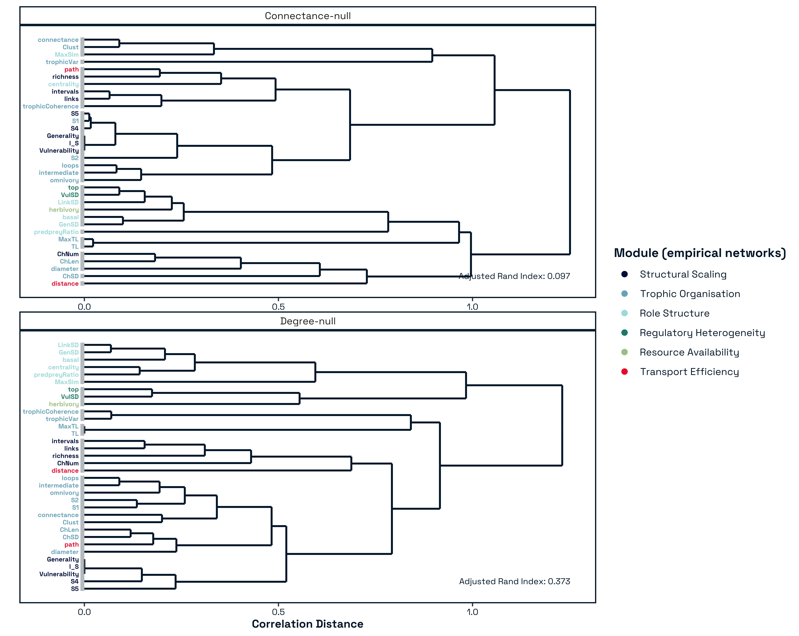
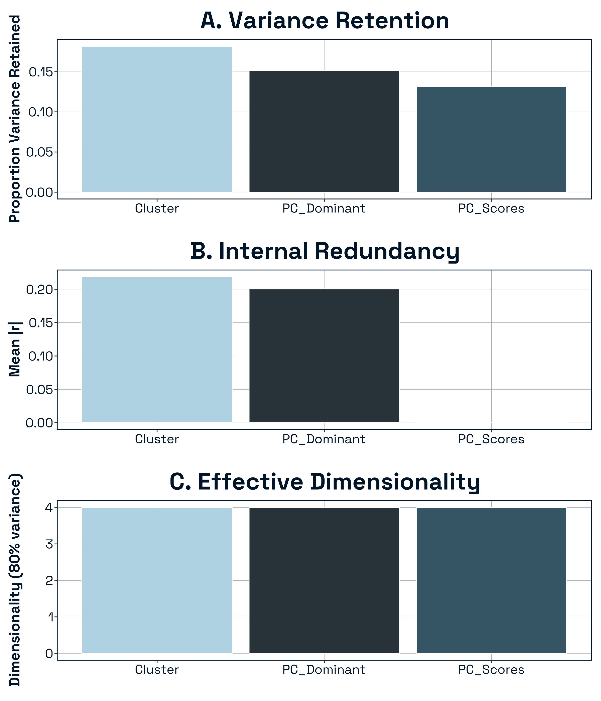

# Extended Methods

# Results

## Structural Metrics Organise into Robust Modules

#### Figure S1: Hierarchical clustering of food web structural descriptors differ for connectance and degree constrained models

Below we illustrate the modular organisation of structural metrics based on a signed correlation matrix. Clustering was performed using UPGMA. Grey bars indicate identified clusters. The horizontal axis represents the correlation distance (1−r), where shorter branches indicate stronger associations between descriptors. Colours of the labels indicate the corresponding module as identified from the empirical data. ARI i shown in the right hand side of the panel and indicates cluster agreement with empirical clusters. Note that some modules (particularly for the degree constrained networks) still cluster together however others do not - this suggests that the modules are independent and suggest that they are not constrained by link-level processes but may reflect other emerging forms of ecological constraints.

{#fig-module}

While modules associated with network size and degree heterogeneity are partially reproduced under degree-preserving randomisation, others show little correspondence with null expectations. This pattern is consistent with a hierarchical assembly process, in which a combinatorial baseline defined by species richness and interaction degree is progressively shaped by ecological constraints governing trophic organisation, energy flow, and species roles. Consequently, the modular structure we identify does not simply reflect statistical artefacts of network size, but captures ecologically meaningful dimensions of network assembly.

## Structural Modules Align with Dominant Axes of Network Variation

{#fig-pca_heatmap}

![*Figure SX.* This figure quantifies the relative contribution of each structural module to the variance captured by individual Principal Components (PCs). Calculation: For each PC, the total variance (eigenvalue) is partitioned among the k=7 modules identified in the hierarchical clustering. The contribution of a module to a specific PC is calculated as the sum of the squared loadings of all metrics belonging to that module, normalised by the total variance explained by that PC. Visual Interpretation: The alluvial plot illustrates how the ecological weight shifts across different structural dimensions. For example, while PC1 may be dominated by a single module, subsequent PCs often represent a more diverse blend of modular contributions, reflecting the multifaceted nature of topological complexity and trophic organisation. Significance: This visualisation confirms that the PC axes are not merely statistical artifacts but are grounded in the specific groups of correlated metrics defined in the main text. The stability of the flow across the first several components demonstrates that the modular organisation of food web architecture is consistently represented across the primary gradients of structural variation.](../figures/variance_explained.png){#fig-variance}

## Predictors of stability

> I think this whole chunk can go to the supp matt - I would argue its not an ecological result but a statistical one

### Dimensional Reduction Characterisation

| Representation      | Dimensionality | Variance Preserved | Structure Type      |
|---------------------|----------------|--------------------|---------------------|
| Medoids             | 7              | 23%                | Domain sampling     |
| PC-dominant metrics | 4              | 13%                | Axis proxy sampling |
| PC scores           | 5              | 80%                | True latent space   |

To evaluate how alternative structural representations differed in their information content and redundancy, we quantified variance retention, internal correlation structure, effective dimensionality, and geometric similarity among representations.

**Variance Retention:** The three representations differed substantially in the proportion of total structural variance preserved (**Fig. SXA**). The cluster-medoid representation retained \~23% of the total variance in the full metric space despite reducing dimensionality to seven predictors. In contrast, the PC-dominant metric set retained only \~13% of total variance, reflecting the fact that individual metrics capture only a fraction of each principal component’s multivariate structure. As expected by construction, the retained PC-score representation preserved approximately 80% of total variance. Thus, domain-based reduction preserved more distributed structural information than selecting one metric per PC axis, whereas the PC-score representation maximally preserved dominant gradients of network variation.

**Internal Redundancy:** Representations also differed in their internal correlation structure (**Fig. SXB**). PC scores were orthogonal by definition (mean \|r\| ≈ 0), indicating complete statistical independence among predictors. In contrast, cluster medoids exhibited moderate residual correlation (mean \|r\| = X), suggesting partial overlap among structural domains. PC-dominant metrics showed comparable (or higher/lower — insert result) redundancy relative to medoids. These differences indicate that the three approaches vary not only in information retention but also in predictor independence.

**Effective Dimensionality:** We next quantified effective dimensionality as the number of axes required to explain 80% of variance within each reduced predictor set (Fig. S1C). The PC-score representation required X axes, reflecting its design to capture dominant structural gradients. The cluster-medoid representation required X axes to reach the same threshold, indicating that despite containing seven predictors, structural variation was concentrated along fewer effective dimensions. The PC-dominant set exhibited the lowest effective dimensionality (X axes), consistent with its reduced variance retention. Together, these results show that dimensional compression differed across approaches not only in magnitude but in the distribution of variance across axes.

Overall, the three structural representations differed substantially in variance retention, redundancy, and effective dimensionality. Cluster medoids preserved moderate variance while maintaining domain interpretability, PC-dominant metrics retained minimal total variance, and PC scores preserved dominant structural gradients while ensuring predictor orthogonality. These differences establish that the representations encode distinct aspects of network topology, justifying their empirical comparison in predictive analyses of stability.

#### Characterisation of alternative dimensional-reduction approaches for network structural metrics.

(A) Proportion of total variance in the full metric space retained by each representation: cluster medoids, PC-dominant metrics, and retained PC scores (≥80% cumulative variance). (B) Mean absolute pairwise correlation (\|r\|) among predictors within each representation, quantifying internal redundancy. (C) Effective dimensionality, defined as the number of axes required to explain 80% of variance within each reduced predictor set. Together, these diagnostics illustrate differences in information retention, redundancy, and structural alignment among dimensional-reduction strategies.

{#fig-dim_red}

# References {.unnumbered}

::: {#refs}
:::
